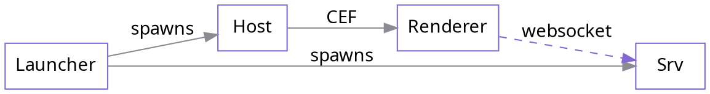

# AgentMux Docs — Diagram System

> **§§3–7 (D2/Graphviz pipeline) are SUPERSEDED — not what's shipped.** The org
> evaluated D2/Graphviz here (June 2026) but ultimately rejected build-time
> auto-layout tooling in favor of **hand-authored SVGs**, which is what actually
> shipped: all 7 "high-value re-render" diagrams this doc's own audit (§2)
> identified now exist as hand-authored SVGs in `public/diagrams/`, and
> `package.json` has never contained `astro-d2`/`@beoe/rehype-graphviz`. See
> `README.md`'s "Diagrams" section for the current, correct, much shorter
> process — **start there, not at §6.** README's own rationale: auto-layout
> tools use abstract font metrics that don't match the hand-tuned design tokens
> in §1 below (which — unlike §§3–7 — is still accurate and used by the SVGs
> that did ship).
>
> Kept for historical reference (§1's design tokens remain the real source of
> truth for any new hand-authored SVG; §2's diagram audit and §8's research
> links are still useful context) — not because the D2 plan might still happen.

Comprehensive audit, tool evaluation, and reusable scheme for all diagrams in `agentmux-docs`, as researched June 2026. **For the actual current process, see `README.md` instead of §6 below.**

---

## 1. Canonical Style Reference

The architecture diagram (`public/architecture.svg`) is the visual standard everything else should match.

### Design Tokens (extracted from architecture.svg)

```
Font family  ui-monospace, SFMono-Regular, Menlo, Consolas, monospace
Font sizes   Title: 18px bold  |  Sub: 14px  |  Card label: 12.5px 600-weight  |  Legend: 12px italic

Box fill     #ffffff (light)  /  #1a1a1e (dark)
Border       Sharp corners (rx/ry CSS properties are ignored on <rect> — always square)

Border accent colors:
  Primary   #8168d3  (purple-indigo)  — launcher, host, main components
  Secondary #419fe0  (blue)           — Chromium renderer, JS frontend
  Tertiary  #5e8fd9  (steel-blue)     — sidecar / srv

Text colors:
  Title     #1c1c1f  /  #f0f0f5 (dark)
  Sub       #44444c  /  #b8b8c2 (dark)
  Card      matches border accent of parent box
  Edge      #44444c  /  #b8b8c2 (dark)
  Legend    #6a6a72 italic  /  #9090a0 (dark)

Edges
  Normal    #8b8b95  /  #6a6a78 (dark), stroke-width 1.5, arrowheads
  IPC       #8168d3, stroke-width 1.6, stroke-dasharray 6 4, arrowheads both ends

Dark mode   @media (prefers-color-scheme: dark) in SVG <style> block
            fills flip; strokes lighten; accent colors unchanged
```

### Architecture SVG node+edge vocabulary

| Element | CSS class | Meaning |
|---|---|---|
| Rect + title/sub/card | `.box` | Core process (launcher, host) |
| Rect + title/sub/card | `.box-alt` | Runtime layer (Chromium, frontend) |
| Rect + title/bullets/card | `.sidecar` | Backend sidecar |
| Solid line + arrows | `.edge` + `#arrow` marker | Sequential / spawning relationship |
| Dashed line + arrows | `.ipc` + `#arrow-ipc` marker | Bidirectional IPC channel |
| Small italic text | `.legend` | Contextual annotation |

---

## 2. Complete Diagram Audit

**14 diagrams found across 13 files.** API typedoc subtree excluded.

---

### 2.1 `internals/reducer-stack.md` — Layer Stack

**Type:** Custom arrow-stack with Unicode ▲ and ┃  
**Complexity:** Medium  
**Current form:** Fenced `text` block

```
Frontend (renderer / SolidJS)         per-process atoms        consumer
   ▲ slice-based reducer migration (9 slices, in flight)
   ┃ CEF JS bridge ▲ events
Host (agentmux-cef)                   FFI + UI thread           Layer 2
   ▲ pending_window_creations, active_drag, tear_off_hooks
   ┃ launcher → host pipe/socket (in flight)
Launcher (agentmux-launcher)          process & OS facts        Layer 1
   ▲ lifecycle, processes, windows, monitors, pool, registries
   ┃ launcher IPC (named pipe / Unix domain socket)
Srv (agentmux-srv)                    app domain                Layer 3
   ▲ workspaces, tabs, blocks, layouts, agents, identity
   ┃ persist subscriber (idempotent SQLite write-back)
Persistence                                                      durability
   ▲ objects.db, filestore.db, sagas.db, launcher-sagas.db
```

**Target format:** D2 — layered nodes with directional edges, `near` labels.

---

### 2.2 `internals/state-model.md` — Layout Tree (Diagram A)

**Type:** Tree with Unicode box-drawing (│ ├ └ ─)  
**Complexity:** Medium  
**Current form:** Fenced `text` block

```
LayoutModel (per-tab, long-lived createRoot)
│
├── localTreeStateAtom: SignalAtom<LayoutTreeState>     ← runtime SoT
│     focusedNodeId ──────────────── read by isFocused memo
│     magnifiedNodeId
│     rootNode ────── LayoutNode (tree)
│
├── treeState: LayoutTreeState                          ← mutable scratch copy
│
├── waveObjectAtom: WritableWaveObjectAtom<LayoutState> ← WOS entry (persisted)
│
├── nodeModels: Map<nodeId, NodeModel>                  ← per-leaf reactive bundle
│
└── treeReducer(action)
      → mutates treeState
      → localTreeStateAtom._set(...)
      → persistToBackend()
```

**Target format:** D2 with tree container layout.

---

### 2.3 `internals/state-model.md` — Focus Reducer Path (Diagram B)

**Type:** Sequential flow with `→` arrows and indentation  
**Complexity:** Simple  
**Current form:** Fenced `text` block

```
User click / keyboard nav
  → model.focusNode(nodeId)
  → model.treeReducer({ type: FocusNode, nodeId })
  → focusNode(this.treeState, action)
  → focusManager.requestNodeFocus()
  → localTreeStateAtom._set(...)
  → focusedNode memo re-evaluates
  → NodeModel.isFocused() returns true
```

**Target format:** D2 sequence or linear flow chain.

---

### 2.4 `internals/state-model.md` — TurnPhase State Machine (Diagram C)

**Type:** State machine with `│` transitions and labels  
**Complexity:** Medium  
**Current form:** Fenced `text` block

```
Idle          ← no turn in flight
Submitting    ← user pressed send, awaiting first stream event
  │  (SubmitTimeoutElapsed after 30s → Done.errored)
Streaming     ← stream producing events
  │  (StreamStalled after 60s idle → Done.errored)
  │  (RequestStop → Interrupting)
Interrupting  ← stop requested, awaiting TurnEnd or unsub
  │  (InterruptTimeoutElapsed after 5s → Done.interrupted)
Done          ← terminal; outcome: completed | stopped | interrupted | errored
Disconnected  ← stream dropped mid-turn; remembers lastKind
```

**Target format:** D2 state diagram with labeled transitions.

---

### 2.5 `internals/state-model.md` — Boundary Summary (Diagram D)

**Type:** Three side-by-side boxes with ┌─┐ │ └─┘  
**Complexity:** Complex  
**Current form:** Fenced `text` block, three stacked full-width boxes with prose inside

```
┌─────────────────────────────────────────────────────────────────────┐
│ LAYOUT TREE (LayoutModel / layoutModel.ts)                          │
│  Owns: tree topology, focused node, magnified node, leaf order …    │
│  Does NOT own: pane state, token counts, message content …          │
│  Focus signal path:                                                 │
│    user click → focusNode() → treeReducer(FocusNode)               │
│              → localTreeStateAtom._set()                            │
│              → NodeModel.isFocused() memo                           │
└─────────────────────────────────────────────────────────────────────┘
[... two more similar boxes for PANE-STATE REDUCERS and WAVEOBJECT STORE]
```

**Target format:** D2 containers / groups with nested prose nodes — or keep as styled `:::note` Starlight asides.

---

### 2.6 `internals/ipc-catalog.md` — IPC Architecture (Diagram A)

**Type:** Complex box-drawing with ┌─┐ │ └─┘ ┬ ▼ and channel labels  
**Complexity:** Complex  
**Current form:** Fenced `text` block

```
  ┌─────────────────────────────────────────────────────────┐
  │  agentmux-launcher  (Windows: named pipe server;        │
  │                       Unix: Unix domain socket server)  │
  └──────────┬──────────────────────────┬───────────────────┘
             │ Channel C (pipe/socket)  │ Channel 13 (pipe)
             ▼                          ▼
  ┌──────────────────────┐   ┌─────────────────────────────┐
  │  agentmux-cef        │   │  agentmux-srv               │
  │  HTTP IPC server     │   │  HTTP + WS server           │
  └───────┬──────────────┘   └───────────┬─────────────────┘
          │ Channel D (pipe)             │
  ┌───────▼──────────────────────────────▼──────────────────┐
  │  Renderer process (Chromium) / SolidJS frontend         │
  │  Channels A, B: fetch POST /ipc  ↔  CustomEvent        │
  │  Channels E, F: WebSocket /ws    ↔  POST /agentmux/svc  │
  └─────────────────────────────────────────────────────────┘
```

**Target format:** D2 — this is the highest-value diagram to re-render as SVG.

---

### 2.7 `internals/ipc-catalog.md` — Process Hierarchy (Diagram B)

**Type:** Tree with `└──` indentation  
**Complexity:** Simple  
**Current form:** Fenced `text` block

```
agentmux-launcher.exe  (owns Win32 Job Object J0)
  └── agentmux-cef.exe     (CEF host, IPC client)
        └── [CEF subprocesses: renderer, GPU, plugin]
  └── agentmux-srv.exe     (backend sidecar, HTTP/WS server)
```

**Target format:** D2 tree or keep as styled `text` — simple enough that re-rendering adds little value.

---

### 2.8 `internals/interagent-comms.md` — Three-Tier Architecture

**Type:** Three stacked boxes with ┌─┐ │ └─┘ and downward `▼` arrows  
**Complexity:** Medium  
**Current form:** Fenced `text` block

```
┌──────────────────────────────────────────────┐
│  Host tier                                   │
│  In-process reactive handler                 │
│  ┌───────────┐   jekt   ┌───────────┐        │
│  │  Agent A  │ ───────▶ │  Agent B  │        │
│  └───────────┘          └───────────┘        │
└──────────────────────────────────────────────┘
        │ mDNS peer-to-peer (LAN tier)
        ▼
┌──────────────────────────────────────────────┐
│  LAN tier — mDNS-discovered peer instances   │
└──────────────────────────────────────────────┘
        │ cloud relay (opt-in)
        ▼
┌──────────────────────────────────────────────┐
│  WAN tier — agentbus cloud relay (opt-in)    │
└──────────────────────────────────────────────┘
```

**Target format:** D2 — good candidate for nested containers.

---

### 2.9 `internals/data-layout.md` — Snapshot Directory Tree

**Type:** `├──` / `└──` directory listing  
**Complexity:** Simple  
**Current form:** Fenced `text` block

```
~/.agentmux/snapshots/<channel>-pre-v<version>-<ISO8601>.bak/
  ├── objects.db
  ├── sagas.db
  └── filestore.db
```

**Target format:** Keep as `text` — it is a directory path listing, not a diagram.

---

### 2.10 `internals/agent-pane-virtualization.md` — Hybrid Virtualization Layout

**Type:** Nested box-drawing with ┌─ label ─┐  
**Complexity:** Medium  
**Current form:** Fenced `text` block

```
┌─ scrollRef (.agent-document) ─────────────────────────┐
│  ┌─ virtualized region ─────────────────────────────┐ │
│  │  height = virtualizer.getTotalSize()             │ │
│  │  rows: position: absolute, translateY(start)     │ │
│  └──────────────────────────────────────────────────┘ │
│  ┌─ streaming buffer (always mounted, last 50 rows) ┐ │
│  │  trailing N nodes, normal flex flow              │ │
│  └──────────────────────────────────────────────────┘ │
└────────────────────────────────────────────────────────┘
```

**Target format:** D2 with nested containers (supports `label` in container syntax).

---

### 2.11 `memory.md` — New Agent Instance UI Mockup

**Type:** Modal dialog wireframe with ┌─┐ │ └─┘  
**Complexity:** Simple  
**Current form:** Fenced `text` block

```
┌────────────────────────────────────────────────┐
│ New Agent Instance                              │
│  Name:         [my-instance______]              │
│  Runtime:      [local | container]              │
│  Identity:     [▼ — Blank (no creds) —    ]     │
│  Memory:       [▼ — Blank (vanilla CLI) — ]     │
│  [Cancel]              [Launch]                 │
└────────────────────────────────────────────────┘
```

**Target format:** Keep as `text` — UI mockups are intentionally rough; rendering as SVG removes that quality.

---

### 2.12 `security/reactive-event-bus.md` — Trust Boundary Diagram

**Type:** Three-node diagram with ┌─┐ │ └─┘ and `▼` arrows  
**Complexity:** Medium  
**Current form:** Fenced `text` block

```
┌─────────────────┐  jekt  ┌─────────────────┐
│  Frontend pane  │ ─────▶ │  Local sidecar  │
│  / MCP client   │        │  (this machine) │
└─────────────────┘        └────────┬────────┘
                                    │ X-AuthKey
                                    ▼
       cross-instance ◀─── peer auth_key from registry
                                    │ outbound poll
                                    ▼
                           ┌──────────────────┐
                           │  Cloud agentbus  │   (opt-in)
                           └──────────────────┘
```

**Target format:** D2 — trust boundary with directional flows.

---

### 2.13 `lan-discovery.md` — LAN Peer Popover Mockup

**Type:** Settings popover wireframe with ┌─┐ │ └─┘  
**Complexity:** Simple  
**Current form:** Fenced `text` block

```
┌─ desk-mac.local ────────────────────────┐
│ OS    Windows 11    IP  192.168.1.42    │
│ ─────────────────────────────────────── │
│ LAN discovery       [ on  🟢 ]          │
│ ◆ 2 peers                               │
│   pi-lab          v0.38.2               │
│   asaf-laptop     v0.38.4               │
└─────────────────────────────────────────┘
```

**Target format:** Keep as `text` — UI mockup, same rationale as 2.11.

---

### Audit Summary

| File | Count | Priority | Target |
|---|---|---|---|
| `internals/ipc-catalog.md` | 2 | High | D2 |
| `internals/interagent-comms.md` | 1 | High | D2 |
| `internals/reducer-stack.md` | 1 | High | D2 |
| `internals/state-model.md` | 4 | High | D2 (3) + keep (1) |
| `internals/agent-pane-virtualization.md` | 1 | Medium | D2 |
| `security/reactive-event-bus.md` | 1 | Medium | D2 |
| `internals/data-layout.md` | 1 | Low | Keep as text |
| `internals/ipc-catalog.md` (process tree) | 1 | Low | Keep as text |
| `memory.md` | 1 | Keep | UI mockup — keep as text |
| `lan-discovery.md` | 1 | Keep | UI mockup — keep as text |

**High-value re-renders (7 diagrams):** ipc-catalog architecture, interagent-comms tiers, reducer-stack layers, state-model tree + focus path + state machine, agent-pane-virtualization layout, reactive-event-bus trust boundary.

---

## 3. Tool Evaluation

> **Superseded — not adopted.** See the top of this doc; hand-authored SVGs shipped instead.

Research conducted June 2026. Sources listed in §7.

### Decision Matrix

| Tool | Build-time | External runtime | Dark mode | Agent-writable | Output quality |
|---|---|---|---|---|---|
| `astro-d2` | ✅ | D2 CLI on PATH | ✅ (class + media) | ✅ | ⭐⭐⭐⭐⭐ |
| `@beoe/rehype-graphviz` | ✅ | None (WASM) | ✅ (CSS class) | ✅ | ⭐⭐⭐⭐ |
| `@beoe/rehype-mermaid` | ✅ | Playwright (~300 MB) | ✅ | ✅ | ⭐⭐⭐ |
| `astro-mermaid` | ❌ runtime | None | ✅ (data-theme) | ✅ | ⭐⭐⭐ |
| `remark-kroki` + Docker | ✅ | Kroki Docker sidecar | Depends on tool | ✅ | Varies |
| `svgbob-wasm` | ✅ | None (WASM stale) | CSS | ❌ (ASCII input) | ⭐⭐ |
| Raw SVG | N/A | None | Via currentColor | ⚠️ (hard) | ⭐⭐⭐⭐⭐ |

### Tool Notes

**D2 (`astro-d2`)** — Best overall fit. Produces the most polished SVG. Build-time only. No headless browser. `skipGeneration: true` lets you pre-commit SVGs for CI environments without D2 CLI. Dark mode works via `theme: { default: '0', dark: '200' }` in config + a remark plugin (HiDeoo-documented) that rewrites `@media` queries to Starlight's `.dark` class selectors for class-based theme toggle. Agents can reliably generate D2 syntax.

**Graphviz (`@beoe/rehype-graphviz`)** — Pure WASM, zero external dependency beyond npm. Ideal for dependency graphs and state machines. DOT language is universally known. Dark mode via CSS `.graphviz` class. `@beoe/sqlitecache` prevents re-rendering on unchanged diagrams.

**Mermaid (`@beoe/rehype-mermaid`)** — Requires Playwright (~300 MB download) in build environment. Acceptable for CI with setup steps; problematic on Cloudflare Pages or minimal containers. Mermaid's output is more generic-looking than D2. Starlight maintainers will NOT bundle Mermaid natively.

**Mermaid (`astro-mermaid`)** — Ships ~1 MB Mermaid JS to the browser at runtime. Violates the no-runtime-JS-for-rendering constraint.

**Kroki + Docker** — Covers all formats (svgbob, pikchr, plantuml, graphviz, mermaid, D2) through one HTTP gateway. Self-hosting is required (public kroki.io sends diagram source off your network). Adds Docker infrastructure to CI. Best choice if you ever need svgbob (ASCII → SVG conversion).

**svgbob-wasm** — The npm package is 4+ years stale (~22 downloads/week). Do not use directly. Route svgbob through Kroki if needed.

**Raw SVG** — Maximum control. `public/architecture.svg` is the canonical example. Appropriate for one-off complex diagrams. Use `currentColor` and CSS custom properties for dark mode. Hard to maintain at scale; agents cannot reliably hand-craft complex SVGs.

---

## 4. Recommendation

> **Superseded — not adopted.** See the top of this doc; hand-authored SVGs shipped instead.

**Primary: `astro-d2`** for architecture, flow, state, and relationship diagrams.  
**Secondary: `@beoe/rehype-graphviz`** for dependency graphs and call graphs.  
**Fallback: Raw SVG** (hand-crafted or Excalidraw-exported) for one-off visual diagrams.  
**Not adopted: `astro-mermaid`** (runtime JS), **`svgbob-wasm`** (stale), **Kroki** (Docker overhead unless ASCII→SVG is needed).

### Installation (when ready to implement)

```bash
# D2 diagrams (primary)
npx astro add astro-d2
# Install D2 CLI: https://d2lang.com/tour/install
# macOS: brew install d2
# Linux: curl -fsSL https://d2lang.com/install.sh | sh -s --

# Graphviz graphs (secondary)
npm install @beoe/rehype-graphviz @beoe/sqlitecache
```

### `astro.config.mjs` additions

```js
import d2 from 'astro-d2';
import { rehypeGraphviz } from '@beoe/rehype-graphviz';
import { SqliteCache } from '@beoe/sqlitecache';

const cache = new SqliteCache({ database: '.cache/diagrams.db' });

export default defineConfig({
  markdown: {
    syntaxHighlight: {
      type: 'shiki',
      excludeLangs: ['d2', 'dot'],  // pass through to rehype plugins
    },
    rehypePlugins: [
      [rehypeGraphviz, { cache, class: 'not-content' }],
    ],
  },
  integrations: [
    d2({
      theme: { default: '0', dark: '200' },  // D2 theme IDs
      inline: true,                           // inline SVG for dark mode support
      skipGeneration: false,                  // set true in CI without D2 CLI
    }),
    starlight({ ... }),
  ],
});
```

---

## 5. Visual Style Guide for D2 Diagrams

> **Superseded — not adopted.** See the top of this doc; hand-authored SVGs shipped instead. The underlying color tokens (§1) are still correct — only the D2-specific application of them below is dead.

Apply these D2 style overrides globally in `astro.config.mjs` or per-diagram as needed to match `public/architecture.svg`.

### D2 theme mapping

D2 Theme ID `0` (Neutral Default) is the closest to the architecture SVG's clean white-box style. The following per-diagram style block brings the colors in line with the canonical style:

```d2
# At the top of any .d2 diagram or inline block:
vars: {
  d2-config: {
    theme-id: 0
  }
}

# Node styling convention:
MyNode: {
  style: {
    font-family: ui-monospace, SFMono-Regular, Menlo, Consolas, monospace
    fill: "#ffffff"
    stroke: "#8168d3"
    stroke-width: 1.5
    border-radius: 0
    font-color: "#1c1c1f"
    font-size: 16
    bold: true
  }
}

# Edge styling convention:
MyNode -> OtherNode: label {
  style: {
    stroke: "#8b8b95"
    font-color: "#44444c"
    font-size: 13
  }
}

# IPC / bidirectional edge:
A <-> B: named pipe {
  style: {
    stroke: "#8168d3"
    stroke-dash: 4
    font-color: "#8168d3"
    bold: true
  }
}
```

### Color reference (quick-copy)

```
Primary accent   #8168d3   (purple-indigo) — core processes, main flows
Secondary        #419fe0   (blue)          — runtime layers (Chromium, JS)
Tertiary         #5e8fd9   (steel-blue)    — sidecar / persistence
Edge             #8b8b95                   — normal relationship edges
IPC edge         #8168d3                   — bidirectional protocol channels
Title text       #1c1c1f
Sub text         #44444c
Muted text       #6a6a72
Box fill         #ffffff  /  #1a1a1e (dark)
```

---

## 6. Agent Guide — How to Add or Update a Diagram

> **Superseded — do NOT follow this section.** Building the D2/DOT pipeline described below was rejected; the shipped process is hand-authored SVG, documented in `README.md`'s "Diagrams" section instead. Kept only so the rejected plan's reasoning stays on record.

### When to use what format

| Situation | Format |
|---|---|
| Architecture, process flow, IPC topology, state machine | ` ```d2 ` block in the markdown file |
| Dependency graph, call graph | ` ```dot ` block in the markdown file |
| One-off complex visual, hand-drawn style | Export SVG → commit to `public/diagrams/` → `` |
| Directory listing, command output | ` ```text ` — do NOT convert to diagram |
| UI mockup / wireframe | ` ```text ` — keep rough, do NOT convert to diagram |

### D2 syntax primer (what agents need to know)

```d2
# Nodes
Launcher: agentmux-launcher
Host: agentmux-cef
Srv: agentmux-srv

# Edges (unidirectional)
Launcher -> Host: spawns
Launcher -> Srv: spawns

# Bidirectional
Launcher <-> Host: named pipe

# Nested containers
Host: {
  Renderer: Chromium 148
  Frontend: SolidJS app
  Renderer -> Frontend: JS bridge
}

# Labels on nodes
Launcher: agentmux-launcher {
  label: "×1 per channel"
}

# Sequences
shape: sequence_diagram
Client -> Server: Request
Server -> DB: Query
DB -> Server: Response
Server -> Client: Result

# State machines
shape: class  # or use direction: down with node styles

# Comments
# this is a comment
```

D2 reference: https://d2lang.com/tour/intro

### Graphviz DOT syntax primer



### Adding a new diagram — step by step

1. **Identify the diagram type** using the table above.
2. **Write the source inline** in the markdown file as a fenced ` ```d2 ` or ` ```dot ` block.
3. **Use the color tokens** from §5 — prefer the preset style block for D2.
4. **Do NOT** add a `text` ASCII fallback inside the same section. The rendered SVG replaces it.
5. **Test the build:** `npm run build` — the diagram plugin renders at build time; build failures mean invalid D2/DOT syntax.
6. **Dark mode:** D2 with `theme: { default: '0', dark: '200' }` in `astro.config.mjs` handles this automatically. Graphviz requires a CSS rule in `custom.css` targeting `.graphviz path, .graphviz polygon { ... }`.

### Updating an existing ASCII diagram

1. Find the `text` block in the source file.
2. Convert the intent (not the exact layout) to D2 or DOT syntax.
3. Replace the ` ```text ` block with ` ```d2 ` (or ` ```dot `).
4. Run `npm run build` to verify.
5. Keep the PR description brief — note the source diagram and the conversion tool used.

### What NOT to do

- Do not convert directory listings (`├──`, `└──`) or UI mockups to SVG diagrams.
- Do not use `astro-mermaid` — it ships ~1 MB JS to the browser.
- Do not use `svgbob-wasm` directly — the npm package is 4+ years stale.
- Do not hand-craft large SVGs — use D2 or the raw SVG + `public/diagrams/` pattern for pre-generated art.
- Do not commit `.cache/diagrams.db` — add it to `.gitignore`.

---

## 7. Migration Priority Queue

> **Superseded — moot.** All 9 diagrams marked 🔴/🟡/🟢 below (everything except the 4 "keep as text" rows) were already hand-authored as SVG in `public/diagrams/`, not migrated to D2/DOT — see the top of this doc.

Ordered by diagram informativeness × current rendering deficiency:

| # | File | Diagram | Priority |
|---|---|---|---|
| 1 | `internals/ipc-catalog.md` | IPC Architecture (2.6) | 🔴 High |
| 2 | `internals/interagent-comms.md` | Three-Tier Architecture (2.8) | 🔴 High |
| 3 | `internals/reducer-stack.md` | Layer Stack (2.1) | 🔴 High |
| 4 | `internals/state-model.md` | TurnPhase State Machine (2.4) | 🟡 Medium |
| 5 | `internals/state-model.md` | Layout Tree (2.2) | 🟡 Medium |
| 6 | `security/reactive-event-bus.md` | Trust Boundary (2.12) | 🟡 Medium |
| 7 | `internals/agent-pane-virtualization.md` | Layout Regions (2.10) | 🟡 Medium |
| 8 | `internals/state-model.md` | Boundary Summary (2.5) | 🟢 Low |
| 9 | `internals/state-model.md` | Focus Reducer Path (2.3) | 🟢 Low |
| ✗ | `internals/data-layout.md` | Directory tree (2.9) | Keep as text |
| ✗ | `internals/ipc-catalog.md` | Process hierarchy (2.7) | Keep as text |
| ✗ | `memory.md` | UI mockup (2.11) | Keep as text |
| ✗ | `lan-discovery.md` | Popover mockup (2.13) | Keep as text |

---

## 8. Sources

- [astro-d2 GitHub (HiDeoo)](https://github.com/HiDeoo/astro-d2)
- [HiDeoo: Add D2 diagrams to Starlight](https://hideoo.dev/notes/starlight-add-diagrams-using-d2/)
- [Ryan Welch: D2 in Astro (Feb 2026)](https://ryanwelch.co.uk/blog/d2-diagrams-in-astro/)
- [D2 language tour](https://d2lang.com/tour/intro)
- [BEOE ecosystem (stereobooster)](https://beoe.stereobooster.com/)
- [@beoe/rehype-graphviz npm](https://www.npmjs.com/package/@beoe/rehype-graphviz)
- [Astro Digital Garden: Graphviz recipe](https://astro-digital-garden.stereobooster.com/recipes/graphviz-diagram/)
- [astro-mermaid GitHub (joesaby)](https://github.com/joesaby/astro-mermaid)
- [Starlight Mermaid discussion #1259](https://github.com/withastro/starlight/discussions/1259)
- [rehype-mermaid GitHub](https://github.com/remcohaszing/rehype-mermaid)
- [Kroki official docs](https://docs.kroki.io/kroki/)
- [remark-kroki GitHub](https://github.com/show-docs/remark-kroki)
- [svgbob-wasm Snyk health](https://snyk.io/advisor/npm-package/svgbob-wasm)
- [pikchr-js npm](https://www.npmjs.com/package/pikchr-js)
- [alexop.dev: Excalidraw dark mode in Astro](https://alexop.dev/posts/excalidraw-dark-mode-astro-diagrams/)
- [Astro experimental SVG optimization](https://docs.astro.build/en/reference/experimental-flags/svg-optimization/)
- [stereobooster: text-to-diagram survey](https://stereobooster.com/posts/text-to-diagram/)
