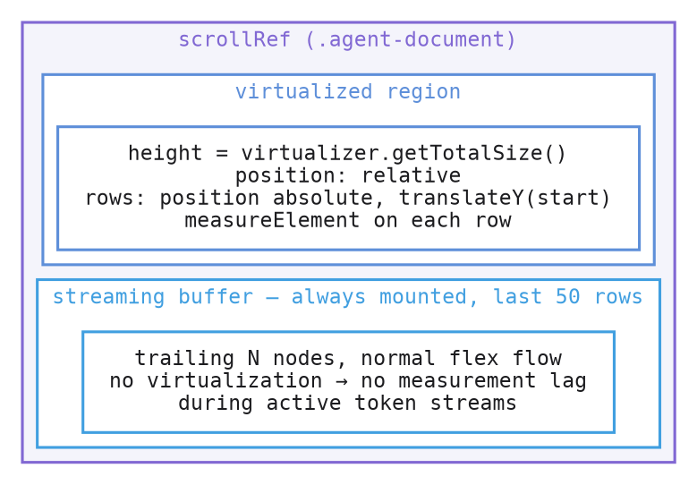

The agent pane displays the conversation as an ordered list of `DocumentNode`s — one per assistant message, user message, tool call, agent-to-agent message, subagent link, etc. Long sessions accumulate 500-2000+ nodes. Rendering all of them in the DOM at once made the layout tree heavy enough that tab-switching INTO a pane with an active agent stalled for 200-300ms.

The renderer (`frontend/app/view/agent/virtualization/`) keeps only ~50 visible rows + 5-row overscan in the DOM at any moment, with the rest virtualized.

## Three architectural decisions

### 1. Hybrid virtualization



The virtualized region uses `@tanstack/solid-virtual` with absolute positioning and per-row `ResizeObserver` measurement. The streaming buffer (the trailing 50 rows) is rendered with a normal `<Index>` so token deltas to active streaming nodes update in place — no recycling, no measurement lag. As rows age past the buffer, they transition into the virtualized region by which point their measurement has stabilized.

Why `<Index>` and not `<For>` for the streaming buffer: each token replaces a node's object reference (immutable update preserves id but produces a fresh value), and `<For>` reconciles by reference, which would unmount and remount the streaming row on every token. `<Index>` keys by position and exposes the item as a Solid signal, so the same `DocumentRow` stays mounted while its `props.node()` re-reads.

### 2. Scroll state in data, not DOM

Anchor and stick-to-bottom flags live in the Solid store (`AgentViewState`):

```ts
{
    nodes: Accessor<readonly DocumentNode[]>,
    nodeIndex: Accessor<ReadonlyMap<string, number>>,  // O(1) id → index
    stickToBottom: Accessor<boolean>,
    headAnchor: Accessor<{ nodeId: string, offsetPx: number } | null>,
    streamingNodeId: Accessor<string | null>,
    // ... atomic mutations: engageStickToBottom, captureHeadAnchor, ...
}
```

The DOM `scrollTop` is a projection of this state, never read back. When history pagination prepends 200 older nodes, the view captures the topmost-visible node id as an anchor, fetches, then restores scroll to that node's new offset. The arithmetic uses node ids, not pixel deltas — robust against `ResizeObserver`-driven height changes that haven't settled yet.

CSS `overflow-anchor: auto` on the scroll container is the cheap belt to the JS suspenders: Chromium auto-pins a visible anchor element when content above it changes height (image loads, tool block expand). The JS layer handles the cases CSS can't (programmatic scroll, remount).

### 3. Per-kind size estimators + intelligent perf probing

Each `DocumentNode` kind declares its own size estimator in the renderer registry:

| Kind | Estimator |
|---|---|
| `agent_message` | text-line heuristic, capped at 320px |
| `user_message` | same, collapsed → 32px |
| `tool` | pinned (expanded) → 200px, collapsed → 32px |
| `agent_section` | 48px |
| `markdown` | text-line heuristic |
| `subagent_link` | 56px (fixed) |

These replace the single `estimateSize: () => 80` from the first retrofit attempt, which produced visible gaps because short messages were given 80px slots.

A dev-mode perf probe (`agent-pane-perf-section.tsx`, accessible via Ctrl+Shift+D in the diag panel) compares each row's measured size against its kind's estimate. When p50 measured size diverges from the estimate by more than 30%, the HUD flags the kind for recalibration. Per-kind p50/p95/max render times also surface here, plus layout-shift events scoped to the agent pane.

All probing is dev-only — `import.meta.env.DEV` is folded to a literal at build time, dead-code elimination drops the probe paths from production bundles.

## What changes for users

Nothing visible in the happy path. The pane scrolls, paginates, jumps to bookmarks, and streams content as before — just with a bounded layout-tree memory cost regardless of session length.

You may notice:
- **Tab-switch into a populated agent pane is dramatically faster.** The 200-300ms long-task storms during reflow are gone; the layout tree is constant-size.
- **Auto-scroll-to-bottom is more deterministic.** Sticky behavior is data-driven (`stickToBottom` flag) instead of read-from-DOM heuristics.
- **Pagination is smoother.** Anchor-based scroll preservation doesn't drift on slow image/font loads.

## Source layout

`frontend/app/view/agent/virtualization/`:

| File | Purpose |
|---|---|
| `state.ts` | `AgentViewState` factory — single source of truth for scroll + streaming state |
| `anchor.ts` | Pure scroll-anchor math (capture, restore, near-top/near-bottom) |
| `streaming-buffer.ts` | `partitionForVirtualization(nodes)` splits the document into virtualized + streaming halves |
| `renderers.ts` | Per-kind renderer registry with estimators and streaming-capability flags |
| `DocumentRow.tsx` | Single row component used by both regions; caller controls positioning via `style` + `ref` |
| `AgentDocumentVirtualList.tsx` | Hybrid renderer wiring everything together |
| `perf-probe.ts` | Dev-mode per-kind timing + estimator-miss detection + layout-shift attribution |

`frontend/app/devtools/agent-pane-perf-section.tsx` — the dev HUD section that polls `agentPerfStore.snapshot()` at 1 Hz and renders the per-kind table.

## Reference

- Spec: `docs/specs/SPEC_AGENT_PANE_VIRTUALIZATION_REDESIGN.md` (in main repo)
- PRs: #783 (foundation), #784 (virtualization layer), #786 (Show capture follow-up + reactive block components), #787 (perf probe)
- Issue: #782
