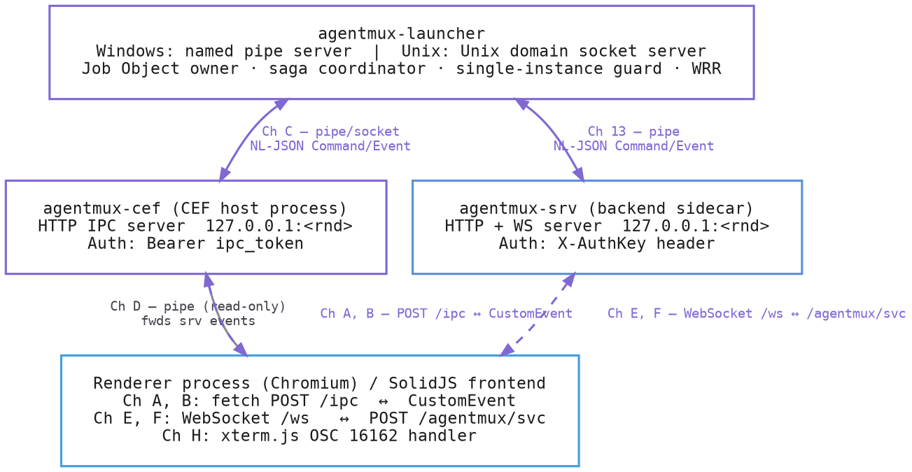

**Version:** 0.44.1  
**Main branch:** 6d282acf  
**Date:** 2026-06-12  

This document catalogs every inter-process channel in AgentMux, their wire contracts, authentication models, and security properties observed in the Sweep 2026-06-12. It is intended as both a developer reference and a security audit anchor point.

---

## Table of Contents

1. [Architecture Overview](#1-architecture-overview)
2. [Channel Summary Table](#2-channel-summary-table)
3. [Channel A: Renderer → Host Local IPC (HTTP)](#3-channel-a-renderer--host-local-ipc-http)
4. [Channel B: Host → Renderer Event Push (CEF JS Bridge)](#4-channel-b-host--renderer-event-push-cef-js-bridge)
5. [Channel C: Host ↔ Launcher Named Pipe](#5-channel-c-host--launcher-named-pipe)
6. [Channel D: Host → Srv Named Pipe (Read-only Bridge)](#6-channel-d-host--srv-named-pipe-read-only-bridge)
7. [Channel E: Renderer ↔ Srv WebSocket (RPC)](#7-channel-e-renderer--srv-websocket-rpc)
8. [Channel F: Renderer → Srv HTTP Service](#8-channel-f-renderer--srv-http-service)
9. [Channel G: Browser DOM API (HTTP over IPC)](#9-channel-g-browser-dom-api-http-over-ipc)
10. [Channel H: OSC 16162 — Terminal Shell Integration Escape Sequences](#10-channel-h-osc-16162--terminal-shell-integration-escape-sequences)
11. [Channel I: Chromium Remote Debug Port (CDP)](#11-channel-i-chromium-remote-debug-port-cdp)
12. [IPC Token and Auth Key — Lifecycle and Leak Surface](#12-ipc-token-and-auth-key--lifecycle-and-leak-surface)
13. [Launcher ↔ Srv Named Pipe (Reducer Bus)](#13-launcher--srv-named-pipe-reducer-bus)
14. [Command/Event Domain Mixing in agentmux-common/src/ipc.rs](#14-commandevent-domain-mixing-in-agentmux-commonsrcipcrs)
15. [Environment Variable Contract](#15-environment-variable-contract)
16. [Security Findings Cross-Reference](#16-security-findings-cross-reference)

---

## 1. Architecture Overview



**Process hierarchy** (production):

```
agentmux-launcher.exe  (owns Win32 Job Object J0)
  └── agentmux-cef.exe     (CEF host, IPC client)
        └── [CEF subprocesses: renderer, GPU, plugin]
  └── agentmux-srv.exe     (backend sidecar, HTTP/WS server)
```

---

## 2. Channel Summary Table

| ID | Name | Transport | Direction | Auth | Purpose |
|----|------|-----------|-----------|------|---------|
| A | Local IPC HTTP | `HTTP POST 127.0.0.1:<rnd>` | renderer→host | Bearer `ipc_token` | All host command dispatch |
| B | CEF JS event push | `frame.execute_javascript()` | host→renderer | none (same process trust) | Push typed events to frontend |
| C | Launcher named pipe / Unix socket | Named pipe (Win) / Unix socket | host↔launcher | none (OS pipe ownership) | Window state mirror, saga dispatch, WRR |
| D | Srv named pipe bridge | Named pipe (Win) / Unix socket | host←srv (read-only) | none (OS pipe ownership) | Forward srv reducer events to renderer |
| E | Srv WebSocket RPC | `WS ws://127.0.0.1:<rnd>/ws` | renderer↔srv | `?authkey=` query param (WS-only) | RPC commands, event bus subscription |
| F | Srv HTTP service | `HTTP POST 127.0.0.1:<rnd>/agentmux/service` | renderer→srv | `X-AuthKey` header | Object CRUD, tab/block/workspace ops |
| G | Browser DOM API | `HTTP POST 127.0.0.1:<rnd>/agentmux/browser/*` | renderer→host | Bearer `ipc_token` | CSS query, JS eval, screenshot, click, key in browser panes |
| H | OSC 16162 | Terminal escape sequence (PTY output) | shell→renderer | none (data in PTY stream) | Inject env keys into block metadata; configure poller |
| I | Chromium remote debug | HTTP/WS 127.0.0.1:9222 (prod) / 9223 (dev) | any local process→renderer | none | CDP automation; used internally by Browser DOM API |
| 13 | Launcher↔Srv named pipe | Named pipe (Win) / Unix socket | launcher↔srv | none (OS pipe ownership) | Srv reducer Command/Event bus |

---

## 3. Channel A: Renderer → Host Local IPC (HTTP)

**Source:** `agentmux-cef/src/ipc.rs`

### Transport

Axum HTTP server bound to `127.0.0.1:0` (random ephemeral port). Port is written to `<data_dir>/ipc-port-<hash>` file as `<port>:<token>` after CEF init. File is owner-readable only on Unix (0600); no Windows DACL restriction on the port file itself (only on `authkey.dev`).

Routes:
- `POST /ipc` — main command handler (`ipc.rs:84`)
- `GET /health` — unauthenticated health check (`ipc.rs:85`)
- `POST /agentmux/browser/*` — Browser DOM API (see Channel G)

### Authentication

`Authorization: Bearer <ipc_token>` header required on `POST /ipc` (`ipc.rs:135-151`).  
`ipc_token` is a random UUID generated once per host process.

**Gap:** `CorsLayer::permissive()` is applied (`ipc.rs:90`), accepting any Origin header. Any web page that guesses or reads the port can make unauthenticated cross-origin preflight-exempt requests (OPTIONS is ignored by the auth check) and then authenticated ones if it has obtained the token.

### Wire Format

JSON body: `{"cmd": "<command_name>", "args": <JSON>}`  
Response: `{"success": bool, "data": <JSON>|null, "error": string|null}` always HTTP 200 (even for errors; frontend checks `success` field). (`ipc.rs:168`)

### Command Catalog

All commands dispatched through `route_command()` (`ipc.rs:181`).

#### Tier 1 — Bootstrap

| Command | Args | Returns | Notes |
|---------|------|---------|-------|
| `get_platform` | — | `"win32"` / `"darwin"` / `"linux"` | |
| `get_auth_key` | — | string | Returns `state.auth_key` — the srv-side auth key. Logged at debug with first 8 chars. |
| `get_is_dev` | — | bool | |
| `get_user_name` | — | string | |
| `get_host_name` | — | string | |
| `get_data_dir` | — | path string | |
| `get_config_dir` | — | path string | |
| `get_user_home_dir` | — | path string | |
| `get_docsite_url` | — | URL string | |
| `get_zoom_factor` | — | number | |
| `get_about_modal_details` | — | object | Version, build label, etc. |
| `get_host_info` | — | object | |
| `get_backend_endpoints` | — | `{web_endpoint, ws_endpoint}` | Srv HTTP + WS addresses |
| `get_wave_init_opts` | — | object | |
| `set_window_init_status` | `{status}` | null | |
| `fe_log` | `{level, msg}` | null | Frontend log relay |
| `fe_log_structured` | `{level, msg, fields}` | null | |

#### Tier 2 — Window Management

| Command | Args | Returns | Notes |
|---------|------|---------|-------|
| `get_backend_info` | — | object | |
| `restart_backend` | — | null | Kills and respawns `agentmux-srv` |
| `close_window` | `{window_label?}` | null | |
| `minimize_window` | `{window_label?}` | null | |
| `maximize_window` | `{window_label?}` | null | |
| `toggle_floating_maximize` | `{...}` | null | |
| `set_zoom_factor` | `{factor}` | null | |
| `is_main_window` | `{window_label}` | bool | |
| `get_window_label` | `{window_label}` | string | |
| `open_new_window` | — | null | |
| `open_subwindow` | `{parent_instance_id}` | null | Hidden subwindow; not user-accessible |
| `open_floating_pane_window` | `{...}` | null | Tear-off pane window |
| `get_instance_number` | `{window_label}` | number | |
| `register_backend_window` | `{window_label, window_id}` | null | Maps label → srv window UUID |
| `get_env` | `{key}` | string \| null | Returns `std::env::var(key)` — any env var on the host process |
| `open_external` | `{url}` | null | Opens URL in OS default browser |
| `reveal_in_file_explorer` | `{path}` | null | |
| `set_window_transparency` | `{...}` | null | |
| `set_window_opacity` | `{window_label, opacity}` | null | |
| `get_window_opacity` | `{window_label}` | number | |
| `start_window_drag` | `{...}` | null | |
| `get_window_rect` | `{window_label}` | rect | |
| `set_window_rect` | `{window_label, rect}` | null | |
| `get_window_position` | `{window_label}` | point | `spawn_blocking` (UI thread bounce, up to 250 ms) |
| `resolve_window_at_cursor` | — | window_label | `spawn_blocking` |
| `update_floating_redock_hover` | `{...}` | null | `spawn_blocking` |
| `clear_floating_redock_hover` | `{...}` | null | |
| `move_window_by` | `{dx, dy}` | null | |
| `set_window_position` | `{x, y}` | null | |
| `toggle_devtools` | `{window_label}` | null | |
| `inspect_element_at` | `{x, y}` | null | |
| `show_context_menu` | — | null | No-op; handled in JS overlay |
| `list_windows` | — | array | |
| `list_window_instances` | — | array | |
| `get_double_click_time` | — | number | |
| `focus_window` | `{window_label}` | null | |
| `close_window_by_label` | `{window_label}` | null | |
| `main_window_focus` | `{window_label?}` | null | Reclaim keyboard focus from pane HWNDs |

#### Cross-window Drag

| Command | Args | Returns |
|---------|------|---------|
| `start_cross_drag` | `{...}` | null |
| `update_cross_drag` | `{...}` | null |
| `complete_cross_drag` | `{...}` | null |
| `cancel_cross_drag` | `{...}` | null |
| `get_cursor_point` | — | `{x,y}` |
| `get_mouse_button_state` | — | object |
| `set_drag_cursor` | — | null |
| `restore_drag_cursor` | — | null |
| `release_drag_capture` | — | null |
| `set_js_drag_active` | `{active}` | null |
| `open_window_at_position` | `{x, y}` | null |
| `tear_off_pool_promote` | `{pool_label}` | null |
| `pool_window_ready` | `{pool_label}` | null |
| `tear_off_sc_move_handshake` | `{...}` | object | `spawn_blocking`, polls up to 2 s |

#### Clipboard

| Command | Args | Returns | Notes |
|---------|------|---------|-------|
| `read_clipboard` | — | string | CEF cannot use `navigator.clipboard` without permission policy |
| `write_clipboard` | `{text}` | null | |

#### Browser Panes

| Command | Args | Returns | Notes |
|---------|------|---------|-------|
| `browser_pane_create` | `{block_id, url, x, y, width, height, window_label?}` | bool | Creates native CefBrowserView child |
| `browser_pane_navigate` | `{block_id, url}` | bool | |
| `browser_pane_resize` | `{block_id, x, y, width, height}` | bool | Fires on every pixel during drag |
| `browser_pane_close` | `{block_id}` | bool | Cancels pending HTTP-auth callbacks |
| `browser_pane_go_back` | `{block_id}` | bool | |
| `browser_pane_go_forward` | `{block_id}` | bool | |
| `browser_pane_reload` | `{block_id}` | bool | |
| `browser_pane_focus` | `{block_id}` | bool | |
| `browser_pane_auth_submit` | `{request_id, username, password}` | bool | Resolves parked CEF `AuthCallback` |
| `browser_pane_auth_cancel` | `{request_id}` | bool | Cancels auth challenge |
| `browser_panes_set_overlay_clip` | `{window_label?, rects[]}` | bool | Clips pane HWNDs around DOM overlays |

#### Provider/CLI Management

| Command | Args | Returns |
|---------|------|---------|
| `detect_installed_clis` | — | array |
| `get_provider_config` | — | object |
| `save_provider_config` | `{config}` | null |
| `get_provider_install_info` | `{provider}` | object |
| `set_provider_auth` | `{provider, ...}` | null |
| `clear_provider_auth` | `{provider}` | null |
| `get_provider_auth_status` | `{provider}` | object |
| `check_cli_auth_status` | `{cli}` | object |
| `install_cli` | `{cli, ...}` | null |
| `get_cli_path` | `{cli}` | string |
| `check_nodejs_available` | — | bool |
| `ensure_auth_dir` | `{provider}` | path |
| `run_cli_login` | `{cli, ...}` | null |
| `cancel_cli_login` | — | null |
| `ensure_settings_file` | — | null |
| `open_in_editor` | `{path}` | null |
| `copy_file_to_dir` | `{src, dst_dir}` | null |
| `consume_drag_paths` | — | array | Returns and clears `drag_stash` |

#### Application

| Command | Purpose |
|---------|---------|
| `run_command` | Command palette execution |
| `open_agent` | Open agent pane |

---

## 4. Channel B: Host → Renderer Event Push (CEF JS Bridge)

**Source:** `agentmux-cef/src/launcher_event_bridge.rs`, `agentmux-cef/src/srv_event_bridge.rs`

### Transport

`frame.execute_javascript(...)` injected by the host into every top-level renderer frame. Not a network channel; runs inside the CEF process boundary.

### Authentication

None. Host process trust. A compromised renderer cannot forge these events; they originate in the Rust host.

### Wire Format

Launcher events dispatched as:
```js
window.__agentmux_launcher_event(<JSON Event>)
```

Srv events dispatched as:
```js
window.__agentmux_srv_event(<JSON Event>)
```

Event shapes are the `agentmux_common::ipc::Event` variants serialized to JSON (`agentmux-common/src/ipc.rs:800-1503`).

### Purpose

- Launcher events: window lifecycle (open/close/pool), instance numbers, WRR drift, saga lifecycle, corrective moves, `HostShouldQuit`.
- Srv events: workspace/tab/block CRUD, layout tree mutations, active-tab changes.

---

## 5. Channel C: Host ↔ Launcher Named Pipe

**Source:** `agentmux-cef/src/launcher_ipc.rs`, `agentmux-common/src/ipc.rs`

### Transport

- **Windows:** Win32 named pipe. Path passed via env var `AGENTMUX_LAUNCHER_PIPE`. Launcher creates with `first_pipe_instance(true)`.
- **Unix/macOS:** Unix domain socket. Same env var name.

Dev mode (`task dev` without launcher, or host invoked directly): `AGENTMUX_LAUNCHER_PIPE` is unset; all `report_*` calls are silent no-ops.

### Authentication

None. OS-level pipe ownership. The host process must be a child of the launcher (enforced by `parent_process::parent_is_agentmux_launcher()` check before connecting, `agentmux-cef/src/main.rs:455-463`).

### Wire Format

Newline-delimited JSON. One message per line.

**Host → Launcher:** `agentmux_common::ipc::Command` variants (externally tagged: `{"cmd":"register",...}`).

**Launcher → Host:** `agentmux_common::ipc::HostFrame` envelope (Phase CPD-1+). Each frame is tagged with `"kind"`:
- `{"kind":"event","event":"<name>",...}` — launcher-emitted `Event` broadcast
- `{"kind":"command","cmd":"<name>",...}` — saga-issued `Command` dispatched to host

Backward-compat: Pre-CPD-2 launchers emit bare `Event` JSON without the `HostFrame` wrapper; the host falls back to parsing as raw `Event` (`launcher_ipc.rs:266-279`).

### Command Variants (Host → Launcher)

| Command | Fields | Purpose |
|---------|--------|---------|
| `Register` | `kind, pid, version` | Handshake; MUST be first message |
| `Ping` | `nonce` | Round-trip confirmation |
| `Goodbye` | — | Graceful disconnect |
| `ReportWindowOpened` | `label, kind, parent_label?` | CEF `on_after_created` fired |
| `ReportWindowClosed` | `label` | CEF `on_before_close` fired |
| `ReportPoolWindowAdded` | `label, saga_id?` | Pool window spawned |
| `ReportPoolWindowRemoved` | `label` | Pool window leaving pool |
| `ReportPoolWindowPromoted` | `label` | Pool → user-visible window transition |
| `ReportHostCounts` | `windows, pool` | Drift detection snapshot |
| `ReportHostPoolCount` | `count` | Pool-only drift snapshot |
| `ReportBackendWindowIdRegistered` | `label, window_id` | Frontend `register_backend_window` |
| `ReportBackendWindowIdUnregistered` | `label` | Window closed |
| `ReportHwndOpened` | `hwnd, class_name, title, label_hint?` | Win32 `EVENT_OBJECT_CREATE` |
| `ReportHwndDestroyed` | `hwnd` | Win32 `EVENT_OBJECT_DESTROY` |
| `ReportHwndVisibilityChanged` | `hwnd, visible` | `EVENT_OBJECT_SHOW/HIDE` |
| `ReportHwndForegroundChanged` | `hwnd` | `EVENT_SYSTEM_FOREGROUND` |
| `ReportHwndIconicChanged` | `hwnd, iconic` | `EVENT_SYSTEM_MINIMIZE*` |
| `ReportHwndPositionChanged` | `hwnd, rect` | `WM_WINDOWPOSCHANGED` (50 ms debounce) |
| `ReportMonitorTopologyChanged` | `rects` | `WM_DISPLAYCHANGE` |
| `ReportPanesReaped` | `label, saga_id?` | Browser-pane HWNDs drained |
| `ReportPoolDrainDecision` | `label, was_last, saga_id?` | Pool-drain-if-last decision |
| `ReportSagaActionFailed` | `saga_id, reason` | Schema-only CPD-1; no producer yet |
| `GetSnapshot` | — | Request full launcher state snapshot |
| `GetSrvSnapshot` | — | Request srv reducer snapshot |
| `GetEvents` | `since` | Replay events since version |
| `SpawnPoolWindow` | `saga_id` | Saga asks host to spawn a pool window |
| `ReapPanes` | `label, saga_id` | Saga asks host to drain pane HWNDs |
| `DrainPoolIfLast` | `label, saga_id` | Saga asks host to drain pool if last window |

### Event Variants (Launcher → Host)

All `agentmux_common::ipc::Event` variants propagated. Key ones:

| Event | Purpose |
|-------|---------|
| `Registered` | Connection ack |
| `Pong` | Ping reply |
| `Error` | Parse/invariant violation |
| `WindowOpened/Closed` | Window mirror updated |
| `PoolWindowAdded/Removed/Promoted` | Pool inventory changed |
| `WindowInstanceAssigned/Released` | Instance number assigned |
| `BackendWindowIdRegistered/Unregistered` | label↔window_id mapping |
| `DriftDetected` | Mirror mismatch |
| `HwndDriftDetected` | CEF/Win32 HWND disagreement |
| `CorrectiveWindowMove` | Reducer-initiated window repositioning |
| `HostShouldQuit` | Last user-visible window gone |
| `SagaStarted/Completed/Failed` | Saga lifecycle |
| `Snapshot` | Full launcher state |
| `SrvSnapshot` | Full srv reducer state |
| `WorkspaceCreated/Deleted/Renamed` | Workspace CRUD |
| `TabCreated/Deleted/Reordered/Moved` | Tab CRUD |
| `BlockCreated/Deleted/Moved` | Block CRUD |
| `LayoutInsertNode` / … (11 layout variants) | Layout tree mutations |

---

## 6. Channel D: Host → Srv Named Pipe (Read-only Bridge)

**Source:** `agentmux-cef/src/srv_ipc.rs`

### Transport

- **Windows:** Win32 named pipe. Path in env var `AGENTMUX_SRV_PIPE_PATH` (set by launcher's `srv_spawner.rs`).
- **Unix:** Unix domain socket (same env var).

Activated only when `AGENTMUX_SRV_PIPE_PATH` is set. Dev builds (`is_dev_build_exe`) short-circuit to None (`main.rs:482-486`).

### Authentication

None. OS-level pipe ownership.

### Wire Format

Same `agentmux_common::ipc::Event` newline-delimited JSON as Channel C. The host reads events from srv's reducer and forwards them to all renderer frames via `srv_event_bridge::dispatch_to_renderers`.

### Direction

Host is a read-only subscriber. No outbound command channel exists today (saga coordinator in Phase E.5+ will add producers).

---

## 7. Channel E: Renderer ↔ Srv WebSocket (RPC)

**Source:** `agentmux-srv/src/server/websocket.rs`

### Transport

WebSocket at `ws://127.0.0.1:<srv_port>/ws`.

### Authentication

`?authkey=<auth_key>` query parameter on the WebSocket upgrade URL (`agentmux-srv/src/server/mod.rs:387-396`). This is the only route that accepts the authkey via query string; all other routes require the `X-AuthKey` header.

**Gap (audit C3):** The query-string authkey is visible in browser history, server access logs, and `Referer` headers on cross-origin navigations. Acceptable for WebSocket (where the browser API does not permit custom headers) but represents a key leak risk if the URL is ever logged or forwarded.

### Protocol

JSON text frames. Two message directions:

**Renderer → Srv (wscommand):**
```json
{"wscommand": "<cmd>", "message": <RpcMessage>}
```
Or type-tagged messages for ping/bus/setblocktermsize/blockinput:
```json
{"type": "ping"|"bus:register"|"bus:send"|"bus:inject", ...}
```

**Srv → Renderer:**
- RPC events: `{"eventtype":"rpc","data":{...}}`
- WaveObj updates: `{"eventtype":"waveobj:update","oref":"block:<id>","data":{...}}`
- MessageBus messages: `{"type":"bus:message","data":{...}}`
- Periodic ping: `{"type":"ping","stime":<ms>}` every 10 seconds

### wscommand Variants

| Command | Purpose |
|---------|---------|
| `COMMAND_EVENT_SUB` | Subscribe to WPS event scope |
| `COMMAND_EVENT_UNSUB` | Unsubscribe from scope |
| `COMMAND_EVENT_UNSUB_ALL` | Unsubscribe all |
| `COMMAND_EVENT_READ_HISTORY` | Replay buffered WPS events |
| `COMMAND_CONTROLLER_INPUT` | Send input to block controller (PTY/stdin) |
| `COMMAND_CONTROLLER_RESYNC` | Force controller state resync |
| `COMMAND_GET_META` | Get block/tab/workspace metadata |
| `COMMAND_SET_META` | Set metadata |
| `COMMAND_GET_FULL_CONFIG` | Get full wconfig |
| `COMMAND_GET_AI_RATE_LIMIT` | Rate limit status |
| `COMMAND_ROUTE_ANNOUNCE` | Announce wshrpc route |
| `COMMAND_ROUTE_UNANNOUNCE` | Deannounce route |
| `COMMAND_SET_CONFIG` | Set config value |
| `COMMAND_APP_INFO` | Get app/version info |
| `COMMAND_SUBPROCESS_SPAWN` | Spawn subprocess in pane |
| `COMMAND_AGENT_INPUT` | Send text to agent PTY |
| `COMMAND_AGENT_STOP` | Stop agent |
| `COMMAND_TOOL_DECISION` | Accept/reject tool call |
| `COMMAND_WRITE_AGENT_CONFIG` | Write agent config |
| `setblocktermsize` | Resize PTY terminal |
| `blockinput` | Send raw bytes to PTY |

**MessageBus over WS:**

| Type | Fields | Purpose |
|------|--------|---------|
| `bus:register` | `agent_id` | Register pane as a bus agent |
| `bus:send` | `from, to, payload, priority?` | Send message to agent |
| `bus:inject` | `target, bus_message` | Inject text into agent PTY |

---

## 8. Channel F: Renderer → Srv HTTP Service

**Source:** `agentmux-srv/src/server/service.rs`, `agentmux-srv/src/server/mod.rs`

### Transport

`POST http://127.0.0.1:<srv_port>/agentmux/service`

### Authentication

`X-AuthKey: <auth_key>` header required (`agentmux-srv/src/server/mod.rs:374-406`). Auth middleware also accepts `?authkey=` query param exclusively on the `/ws` route.

### CORS

`http://127.0.0.1:*` and `http://localhost:*` origins accepted (`mod.rs:143-150`). External origins rejected. This is a narrowing from the previous `CorsLayer::permissive()` that accepted any origin (corrected in 2026-05-11 audit C3).

### Wire Format

```json
POST body: {"service": "<service>", "method": "<method>", "args": [...], "uicontext": {...}}
Response:  {"success": bool, "data"?: ..., "error"?: string, "updates"?: [WaveObjUpdate]}
```

Updates from service calls are broadcast on the event bus to all WebSocket subscribers.

### Service / Method Catalog (representative subset)

| Service | Method | Purpose |
|---------|--------|---------|
| `object` | `GetObject` | Fetch one object by oref |
| `object` | `GetObjects` | Fetch multiple objects |
| `object` | `CreateBlock` | Create a new block |
| `object` | `UpdateObject` | Update object meta |
| `object` | `DeleteBlock` | Delete block |
| `tab` | `CreateTab` | Create tab in workspace |
| `tab` | `CloseTab` | Close tab |
| `workspace` | `CreateWorkspace` | New workspace |
| `workspace` | `DeleteWorkspace` | Delete workspace |
| `window` | `CloseWindow` | Close window |
| Various agent, CLI, identity, install services | | |

---

## 9. Channel G: Browser DOM API (HTTP over IPC)

**Source:** `agentmux-cef/src/browser_api/routes.rs`, registered via `crate::browser_api::register_routes(app)` (`ipc.rs:88`)

### Transport

Same HTTP server as Channel A (`127.0.0.1:<ipc_port>`). Routes under `/agentmux/browser/*`.

### Authentication

`Authorization: Bearer <ipc_token>` header required by every handler (`routes.rs:747-753`).

### Routes

| Route | Method | Purpose |
|-------|--------|---------|
| `POST /agentmux/browser/query` | CSS selector query in pane DOM | Returns matching `Element[]` |
| `POST /agentmux/browser/focus_info` | Get `document.activeElement` | Returns focused `Element` |
| `POST /agentmux/browser/eval` | Run arbitrary JS in pane renderer | Returns serialized value |
| `POST /agentmux/browser/screenshot` | Capture PNG of pane viewport | Returns base64 PNG |
| `POST /agentmux/browser/click_element` | Synthesize mouse click at element centroid | Dispatches `Input.dispatchMouseEvent` |
| `POST /agentmux/browser/focus_element` | Call `.focus()` on first matching element | |
| `POST /agentmux/browser/dispatch_key` | Send text or named key to focused element | Supports `Enter, Tab, Escape, Backspace, ArrowUp/Down/Left/Right, Space` |
| `POST /agentmux/browser/navigate` | Navigate pane to URL via `Page.navigate` | |
| `POST /agentmux/browser/back` | Browser history back | `Page.goBack` |
| `POST /agentmux/browser/forward` | Browser history forward | `Page.goForward` |
| `POST /agentmux/browser/reload` | Reload current page | `Page.reload` |

### Mechanism

All Browser DOM API routes proxy through the Chromium DevTools Protocol (CDP) WebSocket at `ws://127.0.0.1:<debug_port>/devtools/page/<target>` (`routes.rs:49`, `routes.rs:737-744`). The debug port is 9222 (prod) or 9223 (dev) (`main.rs:652`).

**Security: `/agentmux/browser/eval` runs arbitrary JS.** The `eval` route accepts a caller-supplied `script` string and executes it in the pane's JS world via `Runtime.evaluate` with no sandbox or isolation (`routes.rs:201`). The script runs in whatever origin the pane currently loads. Any local process holding the `ipc_token` can execute arbitrary JS in any browser pane.

---

## 10. Channel H: OSC 16162 — Terminal Shell Integration Escape Sequences

**Source:** `agentmux-srv/src/backend/shellintegration/bash.sh` (and zsh, fish, pwsh), `frontend/app/view/term/termosc.ts:177-335`, `frontend/app/view/term/termwrap.ts:160-161`

### Transport

VT escape sequence embedded in PTY output, parsed by xterm.js in the renderer:
```
ESC ] 16162 ; <command> ; <JSON-payload> BEL
```

Registered as an OSC handler on xterm.js number `16162` (`termwrap.ts:160`).

### Authentication

None. The sequence is parsed from PTY byte stream. Any program running in the terminal can emit `OSC 16162` and trigger the handler.

### Commands

| Sub-command | Wire example | Handler action | Security implication |
|-------------|-------------|----------------|---------------------|
| `E` | `\033]16162;E;{"AGENTMUX_AGENT_ID":"Alice","AGENTMUX_AGENT_COLOR":"#ff0000"}\007` | Calls `RpcApi.SetMetaCommand` to write `{"cmd:env": <payload>}` into the block's persistent metadata (`termosc.ts:266-269`). Empty payload clears. | **Env-key injection**: any terminal program can write arbitrary keys into `cmd:env`. Values are then injected into child process environments (`shell.rs:583-591`). The `AGENTMUX_AGENT_COLOR=#000000` Win11 focus-border bug was caused by a user's shell profile emitting this sequence with a black color — no valid value range is enforced. |
| `X` | `\033]16162;X;{"agentmux_url":"https://...","agentmux_token":"tok"}\007` | Makes an authenticated `POST /agentmux/reactive/poller/config` to reconfigure the cloud agentbus poller URL and token (`termosc.ts:289-316`). | **Poller injection**: any terminal program can redirect the srv's outbound polling to an attacker-controlled endpoint. Pre-audit C1/C2 this route was unauthenticated; now requires `X-AuthKey`. |
| `A` | `\033]16162;A;{}\007` | Sets `shell:state = "ready"` in block RT info | State metadata injection |
| `C` | `\033]16162;C;{"cmd64":"<b64>"}\007` | Sets `shell:state = "running-command"`, decodes `cmd64` → `shell:lastcmd` | Last-command display |
| `D` | `\033]16162;D;{"exitcode":0}\007` | Sets `shell:lastcmdexitcode` | Exit code display |
| `I` | `\033]16162;I;{"inputempty":true}\007` | Sets `shell:inputempty` | Input state |
| `M` | `\033]16162;M;{"shell":"bash","shellversion":"5.2","uname":"Linux"}\007` | Sets `shell:type`, `shell:version`, `shell:uname` | Shell metadata |
| `R` | `\033]16162;R;{}\007` | If in alternate screen buffer: writes `ESC[?1049l` to exit alternate screen | Screen reset |

### Shell Integration Deployment

Scripts are embedded in the srv binary (`shellintegration.rs:16-19`) and deployed to `~/.agentmux/shell/<type>/` on first launch or version change. The shell controller sources them via `--rcfile` (bash), `ZDOTDIR` (zsh), `-File` (pwsh), or `-C source` (fish) (`shellintegration.rs:108-165`).

---

## 11. Channel I: Chromium Remote Debug Port (CDP)

**Source:** `agentmux-cef/src/main.rs:652-674`, `agentmux-cef/src/browser_api/routes.rs:49`

### Transport

Chromium DevTools Protocol over HTTP and WebSocket:
- `http://127.0.0.1:9222/json` — list targets (prod)
- `ws://127.0.0.1:9222/devtools/page/<target>` — CDP per-target session

Port is 9222 in production, 9223 in dev builds (`main.rs:652`). No CSP header is configured.

### Authentication

**None.** The CDP endpoint is unauthenticated. Any local process can connect and:
- Enumerate all browser targets (main window and all panes)
- Execute arbitrary JavaScript in any target (`Runtime.evaluate`)
- Capture screenshots
- Intercept network traffic
- Modify DOM

**Note:** `no_sandbox: 1` is set in CEF settings (`main.rs:664`), which means the Chromium renderer processes run without the OS sandbox. This widens the blast radius of any renderer compromise.

### Internal Use

The Browser DOM API (Channel G) connects to CDP per-request via `CdpSession::connect()` to serve its `/agentmux/browser/*` routes. The debug port is stored in `state.debug_port` (`main.rs:653`) and read by `routes.rs:48`.

---

## 12. IPC Token and Auth Key — Lifecycle and Leak Surface

There are two distinct secrets:

| Secret | Name in code | Where generated | Who uses it | Scope |
|--------|-------------|-----------------|-------------|-------|
| `ipc_token` | `state.ipc_token` | Random UUID, host startup | `POST /ipc` (Channel A) and `POST /agentmux/browser/*` (Channel G) | Per-host-process |
| `auth_key` | `state.auth_key` (host); `AppState.auth_key` (srv) | Random UUID, srv startup; passed to host via env or backend-info | `/ws?authkey=` (Channel E) and `X-AuthKey` (Channel F) | Per-srv-process |

### Leak Vectors

| Vector | Leaks | Condition |
|--------|-------|-----------|
| `ipc-port-<hash>` file (`<data_dir>/ipc-port-<hash>`) | `<port>:<ipc_token>` | Always (owner-readable, but data dir may have lax permissions on some installations) |
| `authkey.dev` file (`<data_dir>/authkey.dev`) | Both `ipc_token` and `auth_key`, plus both endpoint addresses | Dev mode only (`AGENTMUX_DEV=1`); file is chmod 0600 (Unix) / DACL-restricted (Windows) (`dev_authfile.rs`) |
| Renderer URL query string | `ipc_token` via `?ipc_token=<token>` (if frontend embeds it in the URL on load) | Visible in process arguments, browser history, `Referer` headers |
| WS URL query string | `auth_key` via `?authkey=<key>` | Visible in server access logs (`server/mod.rs:387`) |
| `get_auth_key` IPC command | `auth_key` | Any caller that already holds `ipc_token` — no additional gate |

### `authkey.dev` File Contents

```json
{
  "version": 1,
  "auth_key": "<uuid>",
  "web_endpoint": "127.0.0.1:<port>",
  "ws_endpoint": "127.0.0.1:<port>",
  "ipc_endpoint": "127.0.0.1:<port>",
  "ipc_token": "<uuid>",
  "service_path": "/agentmux/service",
  "file_path": "/agentmux/file",
  "instance": "v<version>",
  "data_dir": "<path>",
  "host_pid": <pid>,
  "created_at": "<ISO8601>"
}
```

(`dev_authfile.rs:32-45`)

---

## 13. Launcher ↔ Srv Named Pipe (Reducer Bus)

**Source:** `agentmux-common/src/ipc.rs` (shared wire types), `agentmux-launcher/src/` (server side, not read directly)

### Transport

- **Windows:** Named pipe (path keyed on `hash(data_dir, version)` for isolation invariant I5)
- **Unix:** Unix domain socket

### Authentication

None. OS-level pipe ownership + launcher Job Object containment.

### Wire Format

Same `agentmux_common::ipc::Command` / `agentmux_common::ipc::Event` newline-delimited JSON as Channel C. The launcher is the server; srv connects as a client with `ClientKind::Srv`.

### srv-Domain Commands (routed to the srv reducer)

All `Command` variants from the second half of `ipc.rs` (Phase E.x):

| Command | Purpose |
|---------|---------|
| `GetSrvSnapshot` | Request srv reducer full snapshot |
| `CreateWorkspace`, `DeleteWorkspace`, `RenameWorkspace`, `UpdateWorkspaceMeta` | Workspace CRUD |
| `CreateTab`, `DeleteTab`, `SetActiveTab`, `ReorderTab`, `ReorderTabsBulk`, `RenameTab`, `UpdateTabMeta`, `MoveTab` | Tab CRUD and ordering |
| `CreateWindow`, `CloseWindowInternal`, `SwitchWorkspace`, `UpdateWindowMeta` | Window↔workspace mapping |
| `CreateBlock`, `DeleteBlock`, `MoveBlock`, `UpdateBlockMeta` | Block CRUD |
| `SetFocusedNode`, `SetMagnifiedNode` | Layout focus/magnify |
| `LayoutInsertNode`, `LayoutInsertNodeAtIndex`, `LayoutDeleteNode`, `LayoutMoveNode`, `LayoutSwapNodes`, `LayoutResizeNodes`, `LayoutReplaceNode`, `LayoutSplitHorizontal`, `LayoutSplitVertical`, `LayoutClear`, `LayoutSetTree` | Layout tree mutations (E.4.B, 11 variants) |

### Domain Mixing Note

`agentmux-common/src/ipc.rs` (2034 LOC) contains a single `Command` enum that conflates two distinct domains:

- **Launcher domain** (`Register`, `Ping`, `ReportWindow*`, `ReportHwnd*`, `SpawnPoolWindow`, `ReapPanes`, `DrainPoolIfLast`, `GetSnapshot`, `GetEvents`, …) — processed by the launcher's reducer.
- **Srv domain** (`GetSrvSnapshot`, `CreateWorkspace`, `DeleteWorkspace`, `CreateTab`, `LayoutInsertNode`, …) — processed by the srv reducer.

These share a wire-level namespace. The routing logic lives in the respective process's connection handler and is not enforced by the type system. A mis-addressed `CreateWorkspace` sent to the launcher pipe returns `Event::Error { code: InvalidCommand }` rather than a type error.

See `ipc.rs:1-23` for the stated backward-compat policy (externally tagged enums, unknown-command → `Event::Error`).

---

## 14. Command/Event Domain Mixing in agentmux-common/src/ipc.rs

`agentmux-common/src/ipc.rs` is 2034 lines. It defines:

- `ClientKind` enum — `Host`, `Renderer`, `Srv`, `Tool`
- `Command` enum — all commands from both the launcher domain and the srv domain (see §13 above)
- `Event` enum — all events from both domains (~60 variants)
- `HostFrame` — `{"kind":"event"|"command", ...}` CPD-1 envelope
- Helper types: `Rect`, `WindowKind`, `WindowSnapshot`, `LifecyclePhase`, `DriftKind`, `HwndDriftKind`, `Severity`, `ErrorCode`

There is no sub-module or feature-flag separation between launcher-domain and srv-domain variants. Operators reading the enum cannot tell at a glance which variants belong to which pipe. The only documentation is inline comments citing phase numbers (e.g., "Phase E.2", "Phase B.4").

**Recommendation:** Add `// === LAUNCHER DOMAIN ===` and `// === SRV DOMAIN ===` section comments at the boundary within the enum to make the split explicit without requiring a breaking split into two enums.

---

## 15. Environment Variable Contract

The following env vars are injected into PTY child processes by the shell controller (`shell.rs:501-614`) and are consumed by the OSC 16162 shell integration scripts. Their documented meaning, the source that sets them, and known hazards are listed here.

| Variable | Set by | Consumed by | Notes |
|----------|--------|-------------|-------|
| `AGENTMUX` | `shell.rs` (always `"1"`) | Shell integration scripts (guard against nested invocations) | |
| `AGENTMUX_BLOCKID` | `shell.rs` | Shell integration, muxlog | Block UUID for the pane |
| `AGENTMUX_TABID` | `shell.rs` | Shell integration | Tab UUID |
| `AGENTMUX_VERSION` | `shell.rs` | Shell integration (muxlog pointer resolution) | Semver string |
| `AGENTMUX_LOG_DIR` | `shell.rs` | `muxlog` helper | Path to `~/.agentmux/logs/` |
| `AGENTMUX_LOCAL_URL` | `shell.rs` (forwarded from host's env) | Agent CLIs, bashwrap | `http://127.0.0.1:<srv_port>` |
| `AGENTMUX_AGENT_ID` | User's shell profile or `cmd:env` block meta | Shell integration → OSC 16162 E | Pane title/color identity. **Any value from the shell profile flows into block metadata via OSC 16162 E.** |
| `AGENTMUX_AGENT_COLOR` | User's shell profile or `cmd:env` block meta | Shell integration → OSC 16162 E → UI | **Regression root cause:** A user setting `AGENTMUX_AGENT_COLOR=#000000` in their shell profile caused the Win11 focus-border to turn black. No value range validation exists. |
| `AGENTMUX_AGENT_TEXT_COLOR` | User's shell profile | Shell integration | Similar risk to `AGENTMUX_AGENT_COLOR` |
| `TERM` | `shell.rs` (`xterm-256color`) | Terminal applications | |
| `COLORTERM` | `shell.rs` (`truecolor`) | Terminal applications | |
| `TERM_PROGRAM` | `shell.rs` (`agentmux`) | Terminal applications | |
| `ZDOTDIR` | `shellintegration.rs` (zsh only) | zsh startup | Redirects zsh config to `~/.agentmux/shell/zsh/` |
| `AGENTMUX_ZDOTDIR` | `shellintegration.rs` (zsh only) | Integration script | Preserved original ZDOTDIR |

Variables **removed** from the environment when launching non-agent panes (no explicit `cmd:env` agent config, `shell.rs:603-607`):
- `AGENTMUX_AGENT_ID`, `AGENTMUX_AGENT_COLOR`, `AGENTMUX_AGENT_TEXT_COLOR`, `WAVEMUX_AGENT_ID`, `WAVEMUX_AGENT_COLOR`

**Gap:** There is no schema for what values are valid for `AGENTMUX_AGENT_COLOR`. The shell controller accepts and injects whatever value the block meta contains without validation. A color value of `#000000` produced a visible Win11 focus-border regression; other values (e.g., malformed CSS) could cause UI rendering issues.

---

## 16. Security Findings Cross-Reference

This section maps the sweep findings to the specific code locations documented above.

| Finding | Location | Impact | Mitigation status |
|---------|----------|--------|-------------------|
| **`ipc_token` leaks via ipc-port file** | `main.rs:827` writes `port:token` to `<data_dir>/ipc-port-<hash>` | Any process that can read data dir obtains both port and token; can drive Channel A and G fully | File permissions not explicitly restricted (unlike `authkey.dev`). The launcher reads it for single-instance forwarding. |
| **`ipc_token` leaks via renderer URL query** | Frontend's load-time URL (not in scope of this sweep's source read; reported by sweep) | Token in browser history, `Referer`, process arguments | Not mitigated in code seen |
| **`authkey.dev` leaks both tokens (dev mode)** | `dev_authfile.rs:32-45`; written when `AGENTMUX_DEV=1` | Full API access with both `ipc_token` and `auth_key` | File is chmod 0600 / owner DACL. Dev-only. |
| **`get_auth_key` IPC command returns srv auth key** | `ipc.rs:194-197` | Any renderer holding `ipc_token` can obtain `auth_key` (srv-side token) | No separate gate; design intentional (renderer needs both) |
| **`get_env` returns any env var** | `platform.rs:128-137`; `ipc.rs:247` | Renderer can extract `AWS_SECRET_ACCESS_KEY`, `GITHUB_TOKEN`, etc. from the host process environment. Requires `ipc_token`. | No allowlist or blocklist enforced |
| **`/agentmux/browser/eval` runs arbitrary JS** | `routes.rs:201` | Any caller with `ipc_token` can execute JS in any open browser pane (including cross-origin pages). | Auth: `ipc_token` required. No script length or content restriction. |
| **OSC 16162 `E` injects env keys into block meta** | `termosc.ts:262-287` | Any program in the PTY can write arbitrary keys into `cmd:env`. Those keys are injected into future child process environments by `shell.rs:583-591`. | No key allowlist. No value validation. Caused `AGENTMUX_AGENT_COLOR` Win11 bug. |
| **OSC 16162 `X` reconfigures srv poller** | `termosc.ts:289-316` | Any terminal program can set the srv's outbound polling URL/token (pre-audit C1/C2: unauthenticated; post-audit: authed with `auth_key`) | Auth added in 2026-05-11 audit. `auth_key` required from renderer. |
| **`CorsLayer::permissive()` on host IPC server** | `ipc.rs:90` | Any Origin accepted on `http://127.0.0.1:<ipc_port>`. Web pages from the renderer's browsed sites can make preflight-free requests if they guess/obtain the port and token. | Not mitigated. Srv has been narrowed to loopback-only origins (`mod.rs:143-150`); host has not. |
| **CDP port 9222 unauthenticated** | `main.rs:674` | Any local process can enumerate targets, execute JS, capture screens, intercept network. Used internally by Channel G. | No auth. `no_sandbox: 1` widens blast radius. |
| **No CSP on any route** | `ipc.rs`, `srv/server/mod.rs` | XSS in the main window or a browser pane has no Content-Security-Policy barrier. | Not mitigated. |
| **`no_sandbox: 1` in CEF settings** | `main.rs:664` | Renderer processes run without OS sandbox. Renderer compromise can access host filesystem and processes directly. | Required for current platform support; documented limitation. |
| **WS authkey in query string** | `server/mod.rs:387-396` | `auth_key` in URLs, logs, `Referer`. Intentional WS-only exception (browser WS API cannot set custom headers). | Restricted to `/ws` route only by the audit C3 fix. |
| **`AGENTMUX_AGENT_COLOR` no value validation** | `shell.rs:604`; `termosc.ts:263-269` | Shell profile can inject arbitrary CSS color value into block meta → UI rendering with unvalidated color value. Root cause of Win11 focus-border regression. | No validation added as of 0.44.1. |

---

*Document generated by AgentY (sweep 2026-06-12). Sources verified by direct code reads; no features invented.*
