:::caution[Alpha Software]
AgentMux is **alpha software** and under heavy active development. Many features described in these docs may be incomplete, unstable, or not yet implemented. Expect breaking changes between releases. We welcome bug reports and feedback on [GitHub Issues](https://github.com/agentmuxai/agentmux/issues) or [Discord](https://discord.com/invite/96erama9Ar).
:::

Complete reference for all AgentMux settings. Settings are stored in `settings.json` and edited directly in your default editor.

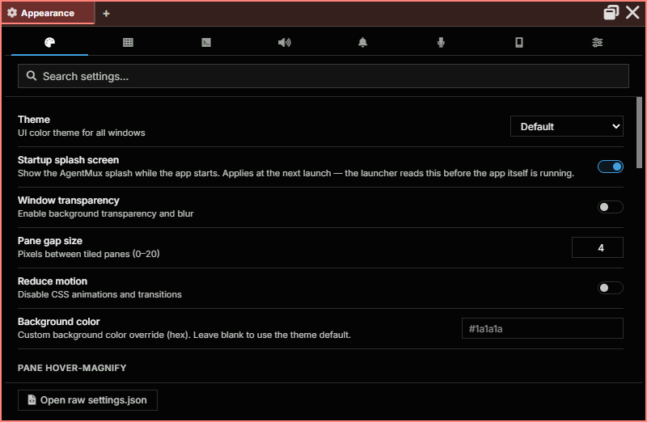

## Opening Settings

Settings is a **pane view** with ten tabs — Appearance, Window & Panes, Browser, Terminal, Sounds, Notifications & Tray, Recording, Paired devices, Widgets and Advanced (see [The Settings tabs](#the-settings-tabs)) — it's registered as `defwidget@settings` in the widget bar (unpinned by default, reachable from the widget bar's overflow) and also reachable from the **hamburger menu**:

1. Click the hamburger icon (≡) at the start of the tab bar.
2. Select **Settings**.
3. AgentMux opens (or focuses) the Settings pane.

Editing `settings.json` directly still works and is reflected in the pane — use the command palette ("Open Settings File"), or **Open raw settings.json** at the bottom of the pane, if you want the raw file instead of the UI.

Type in **Search settings…** at the top of the pane to find a setting on any tab:

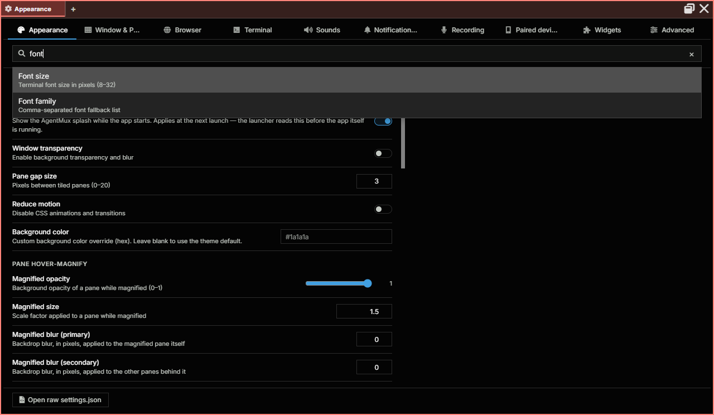

The hamburger menu also includes inline submenus for the most-changed preferences so you don't have to touch the file directly:

- **Theme** ▸ Pick a dark theme (`Default`, `Midnight`, `High Contrast`, `Monokai`, `Nord`, `Dracula`, `Catppuccin`, `Tokyo Night`, `Gruvbox`) or a light one (`Light`, `Catppuccin Latte`, `Solarized Light`, `Gruvbox Light`). Selection persists across restart (writes `window:theme`).
- **Opacity** ▸ Global window translucency from 100% down to 35% in 5% steps (writes `window:opacity` + `window:transparent`). For per-window control, use the InstancePanel slider — click the version chip in the status bar. See [Window appearance](/window-appearance/).

Under `Midnight` specifically, the agent pane background is pure black; other panes use the theme's deep-navy `--main-bg-color`.

## The Settings tabs

### Appearance

The theme, the startup splash screen, window transparency, the gap between panes, reduced motion, a custom background colour, and how a pane looks while it's hover-magnified.

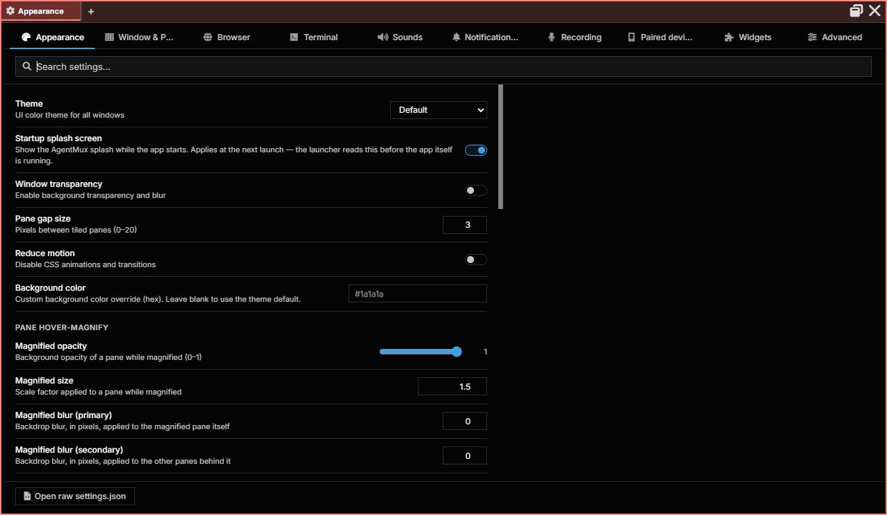

### Window & Panes

Pane block ids in headers (a debugging aid), the view a new tab or pane opens with, the numbered overlay for jumping to a pane, and whether closing a tab asks first.

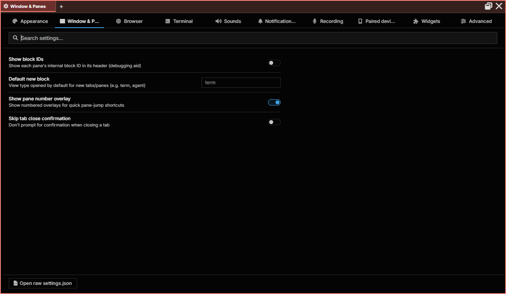

### Browser

Browser profiles: each keeps its own sign-ins, cookies and site data, so one site can be open as two accounts side by side. **Personal** is the profile every tab starts with and can't be removed; add others by name. An agent can browse as a profile only if you allow it for that profile. See [Browser pane](/browser-pane/).

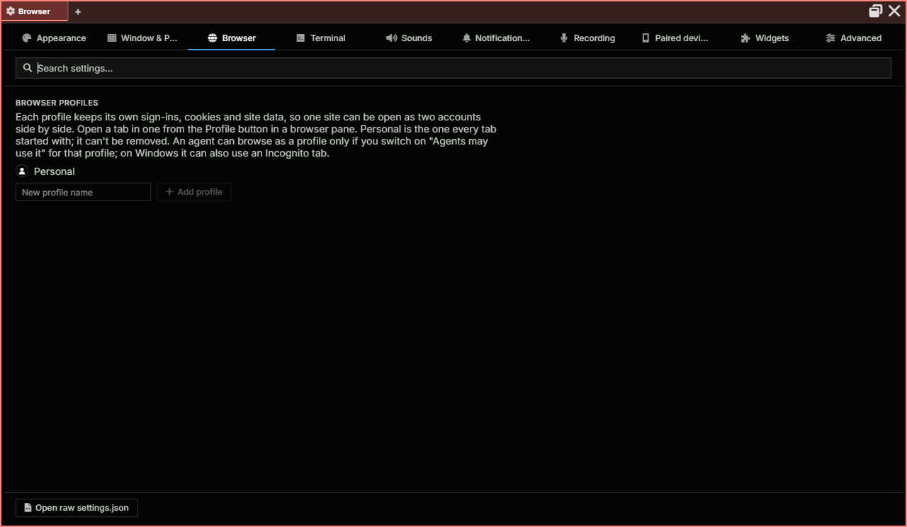

### Terminal

Font size and family, scrollback, copy on select, Shift+Enter, keeping SSH sessions alive and installing AgentMux's helper on new SSH hosts, bracketed paste, transparency and scroll speed. See [Terminal Settings](#terminal-settings) for the matching `settings.json` keys.

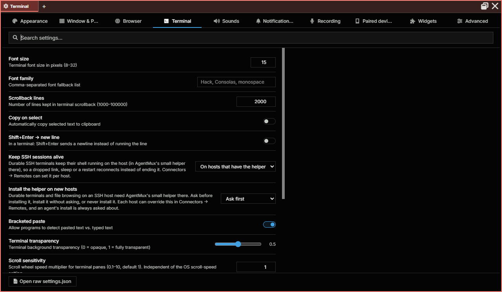

### Sounds

Notification sounds and their volume, whether to stay quiet for a pane you're already looking at, flashing the tab and pane a sound came from, a switch for each event (turn complete, error or interrupted; a queued message accepted or rejected), and tool-call tones.

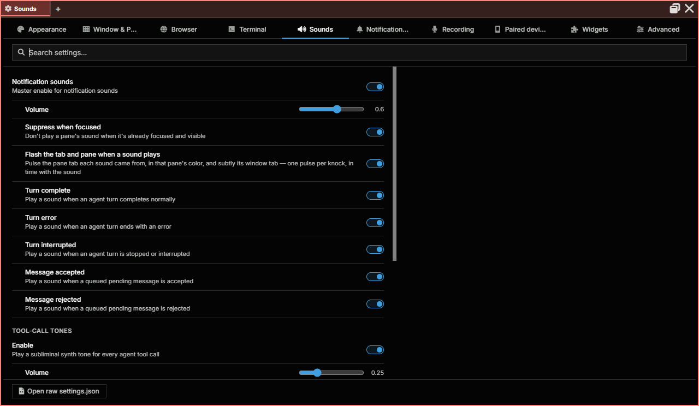

### Notifications & Tray

Desktop notifications: when to notify, and for which events (an agent has a question, finished, stopped with an error or unexpectedly, a message needs your review, signed out of MuxBus); and the system tray: the tray icon, staying in the tray after the last window closes, and starting at login. See [App Settings](#app-settings).

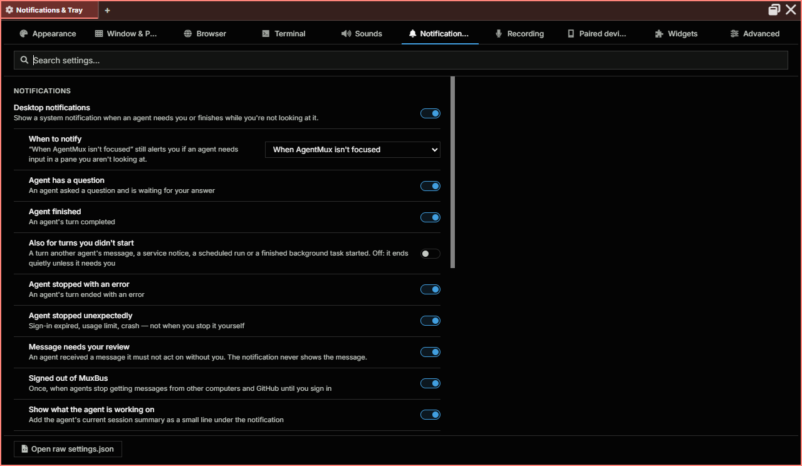

### Recording

Voice input: the microphone button on agent and terminal panes, the transcription engine (whisper.cpp runs offline; Groq sends audio to Groq's API, with your own API key), the input device, and a microphone test. See [Voice input](/pane-types/#voice-input).

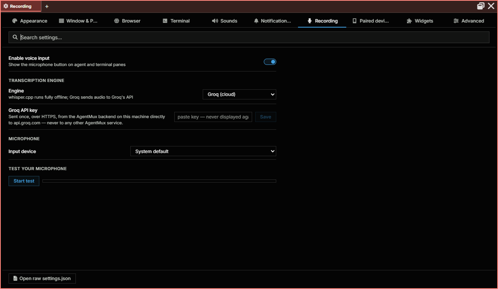

### Paired devices

Devices paired with this computer over your local network, each of which you can revoke; MuxBus sign-in; cloud presence; and whether the status bar shows MuxBus Cloud. See [LAN discovery](/lan-discovery/).

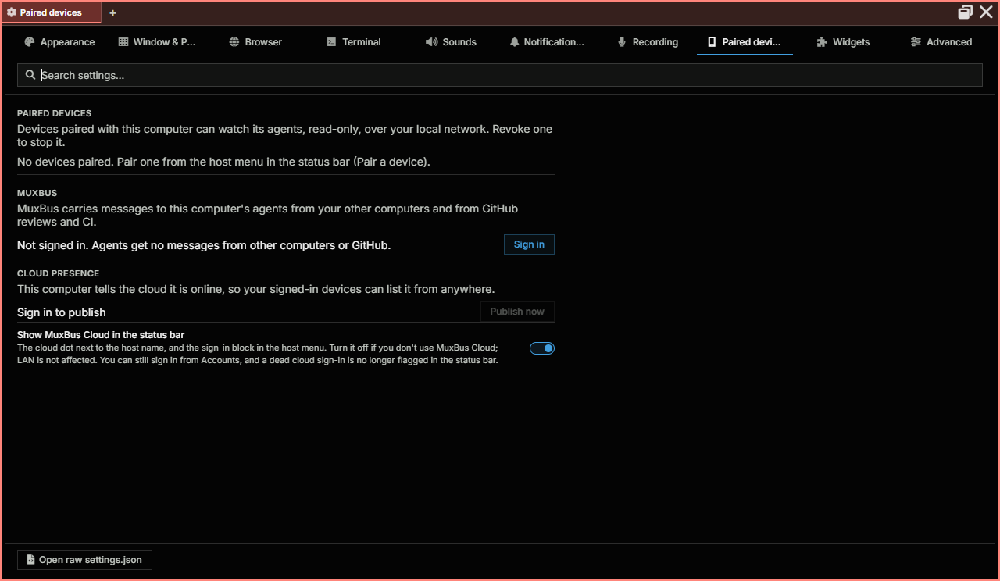

### Widgets

Your own widgets: install one from a `widget.json` or a `.zip`, rescan, or open the widgets folder. A widget runs only after you approve it here. See [Your own widgets](/widgets/).

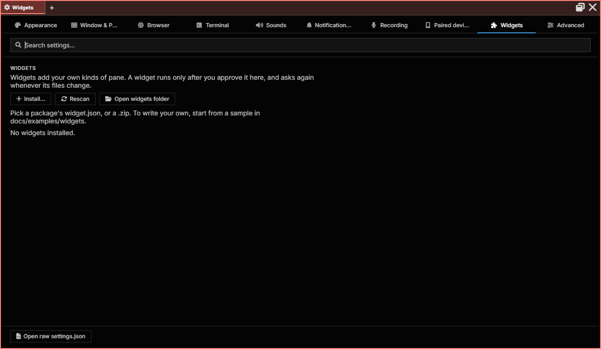

### Advanced

Power-user settings: WebGL terminal rendering, the agent pane's auto-answer timeout, icon-only widget labels, the Sysinfo sample interval and history, and drag and drop.

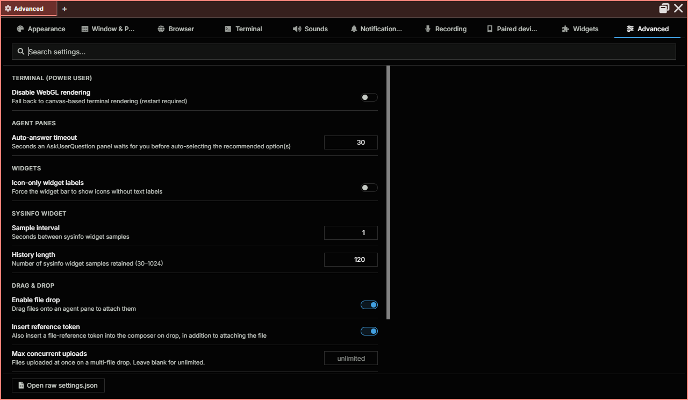

## Settings File Location

Settings live under the channel's data dir, so every version that binds to the same channel reads and writes the same `settings.json`:

| Mode | Path |
|---|---|
| Installed / Portable | `~/.agentmux/channels/<channel>/config/settings.json` (default channel: `stable`) |
| Dev (`task dev`) | `~/.agentmux/dev/<branch>/<clone-id>/config/settings.json` |

The `<channel>` segment is `stable` by default for Installed and downloaded Portable builds, `local-<branch>` for locally-packaged builds, or whatever `AGENTMUX_CHANNEL=<name>` overrides to. Dev mode keys on the git branch plus a per-clone hash so two checkouts of the same branch don't collide. Override the `~/.agentmux/` root with `AGENTMUX_HOME_OVERRIDE` for tests. See [Multi-instance & dev mode](/multi-instance/) for the full layout.

## Terminal Settings

| Setting | Type | Default | Description |
|---------|------|---------|-------------|
| `term:fontsize` | number | `12` | Font size in pixels |
| `term:fontfamily` | string | `"JetBrains Mono"` | Font family |
| `term:theme` | string | `"default-dark"` | Terminal color theme |
| `term:scrollback` | number | `1000` | Scrollback buffer lines |
| `term:copyonselect` | boolean | `true` | Auto-copy text on selection |
| `term:transparency` | number | `0.5` | Pane transparency (0.0–1.0) |
| `term:localshellpath` | string | `"/bin/bash"` | Default shell executable |
| `term:localshellopts` | array | `[]` | Shell launch arguments |
| `term:disablewebgl` | boolean | `false` | Disable WebGL renderer (falls back to Canvas) |
| `term:allowbracketedpaste` | boolean | `true` | Enable bracketed paste mode |
| `term:shiftenternewline` | boolean | `false` | Shift+Enter creates newline |
| `term:agentmaxruntimehours` | number | `0` | Max runtime for an agent pane in hours (`0` = unlimited) |
| `term:agentidletimeoutmins` | number | `0` | Idle timeout for an agent pane in minutes (`0` = unlimited) |
| `term:predictiveecho` | boolean | `true` | Show typed characters locally before PTY echo confirms them. Disable for strict server-echo-only behavior. |
| `term:predictiveecho:thresholdms` | number | `0` | Only predict when rolling p50 round-trip ≥ this value (ms). `0` = always predict once armed. |

## Window Settings

| Setting | Type | Default | Description |
|---------|------|---------|-------------|
| `window:theme` | string | `"default"` | UI color theme. One of `default`, `midnight`, `high-contrast`, `monokai`, `nord`, `dracula`, `catppuccin`, `tokyo-night`, `gruvbox`, or the light themes `light`, `catppuccin-latte`, `solarized-light`, `gruvbox-light`. Easier to switch from the hamburger menu's `Theme` submenu. |
| `window:transparent` | boolean | `false` | Enable window transparency |
| `window:blur` | boolean | `false` | Blur background (macOS only) |
| `window:opacity` | number | `1.0` | Window opacity (0.0–1.0). The hamburger menu's `Opacity` submenu (global) and the InstancePanel per-window slider both clamp to 0.35–1.0; direct edits to `settings.json` accept any number. Windows only — see [Window appearance](/window-appearance/). |
| `window:bgcolor` | string | `""` | Custom background color |
| `window:zoom` | number | `1.0` | Global zoom factor |
| `window:tilegapsize` | number | `3` | Gap between panes in pixels |
| `window:showmenubar` | boolean | `false` | Show native menu bar |
| `window:nativetitlebar` | boolean | `false` | Use native title bar |
| `window:confirmclose` | boolean | `false` | Confirm before closing window |
| `window:savelastwindow` | boolean | `true` | Restore last window size and position |
| `window:dimensions` | string | `""` | Saved window dimensions (WxH) |
| `window:reducedmotion` | boolean | `false` | Reduce animations |
| `window:magnifiedblockopacity` | number | `0.6` | Opacity of background when a pane is magnified |
| `window:magnifiedblocksize` | number | `0.9` | Size of magnified pane (0.0–1.0) |
| `window:magnifiedblockblurprimarypx` | integer | — | Primary blur radius (px) behind a magnified pane |
| `window:magnifiedblockblursecondarypx` | integer | — | Secondary blur radius (px) behind a magnified pane |
| `window:maxtabcachesize` | number | `10` | Maximum cached tabs |
| `window:disablehardwareacceleration` | boolean | `false` | Disable GPU acceleration |

## App Settings

| Setting | Type | Default | Description |
|---------|------|---------|-------------|
| `app:defaultnewblock` | string | `""` | Default pane type for new panes |
| `keybindings` | array | `[]` | Your own keyboard shortcuts, applied over the defaults. See [Keybindings](/keybindings/#your-own-shortcuts). |
| `app:defaultmodel` | string | `""` | Default model for new agent panes (e.g. `"claude-sonnet-4-6"`). When blank, the Launch Agent modal uses the model from the selected bundle, or the provider's default if none is set. |
| `app:showoverlayblocknums` | boolean | `false` | Show pane numbers as overlay |
| `app:dismissarchitecturewarning` | boolean | `false` | Suppress the architecture-mismatch notice |
| `app:showtray` | boolean | `true` | Show the AgentMux icon in the system tray (menu bar on macOS). Applies at the next launch. See [System tray](/installation/#system-tray). |
| `app:runinbackground` | boolean | `false` | Keep AgentMux running in the tray after its last window closes, instead of quitting. Also shows the tray icon. Applies at the next launch. |
| `app:startatlogin` | boolean | `false` | Start AgentMux in the tray, without a window, when you log in. Applies immediately; the tray menu has the same switch. |

## File drop and attachment settings

See [Dropping files onto panes](/pane-types/#dropping-files-onto-panes) and [Attaching files](/pane-types/#attaching-files).

| Setting | Type | Default | Description |
|---------|------|---------|-------------|
| `dnd:enabled` | boolean | `true` | File drops onto agent and terminal panes. Media and editor pane drops, and pasting, aren't affected. |
| `dnd:agentinserttoken` | boolean | `true` | When a drop copies files into an agent's working folder, insert an `@name` reference for each file into the message box. |
| `dnd:concurrency` | integer | unlimited | How many files of a multi-file drop are copied at once. |
| `attachments:enabled` | boolean | `true` | Files dropped on an agent pane are attached to the message. When `false`, they're copied into the agent's working folder instead. |
| `attachments:maxfiles` | integer | `128` | Most files one message can carry. |
| `attachments:maxtotalmb` | number | `1024` | Most megabytes (original sizes) one message can carry. |
| `attachments:sendmaxedge` | integer | `2000` | Long edge, in pixels, of the copy of each image the agent receives. |
| `attachments:claudeinlinemax` | integer | `20` | Images Claude receives inline in one message; the rest are listed by path. `0` sends paths only. |
| `attachments:claudesessioninlinemb` | number | `50` | Megabytes of inline images one Claude session may receive; after that, images go by path only. |
| `attachments:retentiondays` | number | `30` | Days an attachment's files are kept after last use. Files never sent are removed after 7 days. |

## Shell Environment

| Setting | Type | Default | Description |
|---------|------|---------|-------------|
| `cmd:env` | object | `{}` | Environment variables passed to all shell processes |

## Telemetry Settings

| Setting | Type | Default | Description |
|---------|------|---------|-------------|
| `telemetry:enabled` | boolean | `false` | Enable the local Sysinfo pane's metrics sampler. Despite the name, this isn't analytics or crash-reporting — it's a purely local CPU/memory/disk/network sampling loop for the Sysinfo widget; nothing is ever sent off-device. Off by default. |
| `telemetry:interval` | number | `1.0` | Metrics collection interval in seconds |
| `telemetry:numpoints` | number | `120` | Number of history data points to track |

## Connection Settings

| Setting | Type | Default | Description |
|---------|------|---------|-------------|
| `conn:wshenabled` | boolean | `true` | Enable wsh shell integration on remote connections |
| `conn:askbeforewshinstall` | boolean | `true` | Prompt before installing wsh on remote hosts |

## Network Settings

| Setting | Type | Default | Description |
|---------|------|---------|-------------|
| `network:lan_discovery` | boolean | `false` | Advertise this instance + browse for peer AgentMux instances via mDNS. Off by default — on Windows, flipping it on triggers the firewall prompt for UDP 5353. See [LAN discovery](/lan-discovery/) for the toggle in the HostPopover (preferred over editing this file directly, since the UI flips the daemon live without a restart). |

## Other Settings

| Setting | Type | Default | Description |
|---------|------|---------|-------------|
| `widget:showhelp` | boolean | `true` | Show Help widget in top bar |
| `widget:icononly` | boolean | `false` | Icon-only widget bar (no labels) |
| `blockheader:showblockids` | boolean | `false` | Display pane IDs in pane headers |
| `preview:showhiddenfiles` | boolean | `false` | Show hidden files in file previews |
| `tab:preset` | string | `""` | Default tab layout preset |

## MCP Servers

MCP servers are configured **per-agent** in a [bundle](/bundles/), not via a global `settings.json` key. The agent runtime materializes the bundle's `mcp_servers` field into the agent's `.mcp.json` at launch and the AgentMux MCP server is auto-injected alongside any user-defined entries.

See [Bundles](/bundles/) for the bundle schema (including the `mcp_servers` field).

## Environment Variables

AgentMux respects these environment variables:

| Variable | Purpose |
|----------|---------|
| `AGENTMUX_HOME_OVERRIDE` | Override the `~/.agentmux/` root (intended for tests) |
| `AGENTMUX_RUNTIME_MODE` | Set by the launcher; consumers read it to know they're running installed/portable/dev |
| `AGENTMUX_DATA_DIR`, `AGENTMUX_CONFIG_DIR`, `AGENTMUX_LOG_DIR`, … | Per-instance paths exported by the launcher; never set these manually |
| `CLAUDE_CONFIG_DIR` | Per-instance Claude Code auth/config dir; AgentMux sets this automatically |
| `CODEX_HOME` | Per-instance Codex CLI auth dir |
| `GEMINI_CLI_HOME` | Per-instance Gemini CLI auth dir |
| `GEMINI_FORCE_FILE_STORAGE` | `true` — required for Gemini CLI auth-dir isolation |
| `OPENCLAW_HOME` | Per-instance OpenClaw auth dir |
| `KIMI_SHARE_DIR` | Per-instance Kimi Code CLI auth dir |
| `COPILOT_HOME` | Per-instance GitHub Copilot CLI auth dir |
| `PI_HOME` | Per-instance Pi auth dir |
| `CLAUDE_API_KEY` | Optional fallback for Claude agent panes (OAuth is the primary path) |
| `OPENAI_API_KEY` | Optional fallback for Codex agent panes (OAuth is the primary path) |
| `GEMINI_API_KEY` | Optional fallback for Gemini agent panes (OAuth is the primary path) |

The per-provider `*_HOME` / `*_CONFIG_DIR` variables are set automatically by AgentMux at launch (sourced from each provider's `authConfigDirEnvVar` field in `PROVIDERS`). Setting them manually is only useful when scripting an out-of-AgentMux workflow against the same auth dirs.

## Data Directories

For installed and portable release builds (v0.41.1+), state is split across **version-scoped** paths (one set per release, isolated so concurrent versions can't collide) and **channel-wide** paths (shared across all versions of the same channel, so they survive upgrades). Dev builds (`task dev`) skip the version-scoping and use a single per-(branch, clone) dir.

| Purpose | Path | Scope |
|---|---|---|
| Config (`settings.json`, per-provider auth-config-dir homes) | `~/.agentmux/channels/<channel>/config/` | Channel-wide |
| Agent definitions | `~/.agentmux/channels/<channel>/agents/` | Channel-wide |
| SQLite stores (objects, filestore, sagas) | `~/.agentmux/channels/<channel>/versions/<v>/data/db/` | Version-scoped |
| Launcher event log (JSONL) | `~/.agentmux/channels/<channel>/versions/<v>/data/launcher-events.log` | Version-scoped |
| Logs — host (rotated daily, 7-day retention) | `~/.agentmux/channels/<channel>/versions/<v>/logs/` | Version-scoped |
| Logs — sidecar (rotated daily) | `~/.agentmux/logs/agentmuxsrv-v<v>.log.<date>` | Account-wide |
| CEF cache (cookies, local storage, IndexedDB) | `~/.agentmux/channels/<channel>/versions/<v>/cef-cache/` | Version-scoped |
| Account-wide state (dictionaries, cross-channel shared) | `~/.agentmux/shared/` | Account-wide |
| Dev mode root | `~/.agentmux/dev/<branch>/<clone-id>/` | Per-(branch × clone), no version split |

See [Data layout](/internals/data-layout/) and [Multi-instance & dev mode](/multi-instance/) for the full layout and the historical migration from per-version → channels → channels-plus-version-scoped-runtime.

## See Also

- [Configuration](/config) — Settings overview with examples
- [Keybindings](/keybindings) — Keyboard shortcuts
- [Bundles](/bundles/) — Per-agent configuration
- [System Metrics](/system-metrics) — Telemetry settings explained
