:::caution[Alpha Software]
AgentMux is **alpha software** and under heavy active development. Many features described in these docs may be incomplete, unstable, or not yet implemented. Expect breaking changes between releases. We welcome bug reports and feedback on [GitHub Issues](https://github.com/agentmuxai/agentmux/issues) or [Discord](https://discord.com/invite/96erama9Ar).
:::

Each widget as it looks the first time it opens in a new install: a pane of its own in an 800×600 window, with no agents, accounts, history or content yet. They show what each widget is and where things are; widgets in daily use are fuller. For what each one does, see [Pane Types](/pane-types/). To add widgets of your own, see [Your own widgets](/widgets/).

## Agent

Start and resume agents. **My Agents** lists yours; **New Agent** offers the harnesses you can start one with (Claude Code, Codex, Gemini and others), installing any that are missing.

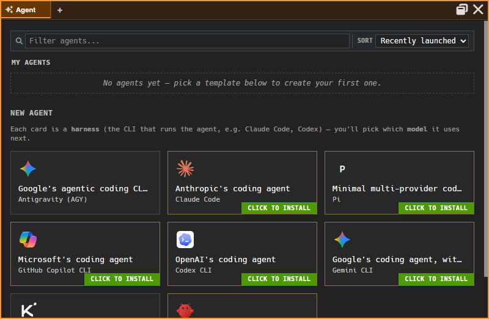

## Swarm

A live tree of your agent panes with their subagents, todos and background commands. Empty until an agent is running. See [Swarm](/subagent-watcher/).

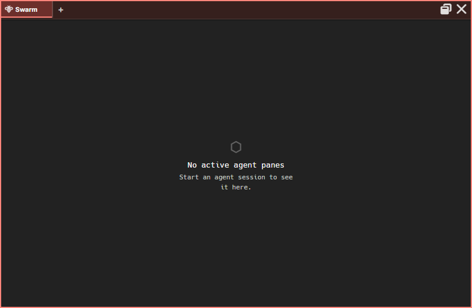

## Hangar

A file browser with places, drives, sorting, previews and drag and drop. Here it shows a small demo project.

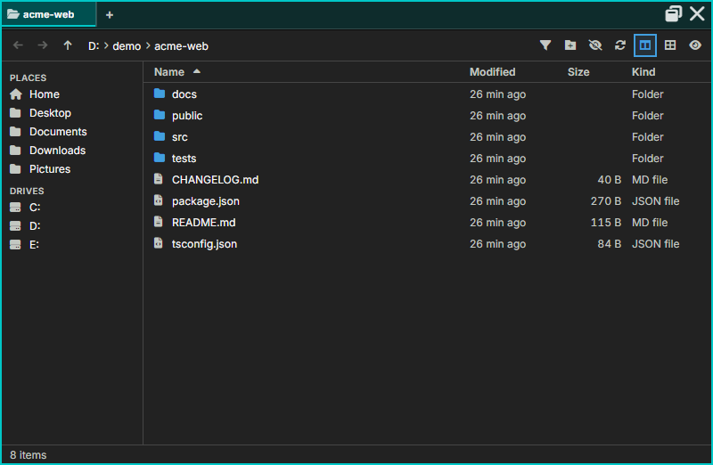

## Terminal

A full terminal with a real shell. The chip beside the tab shows where it runs; switch it to an SSH host from there.

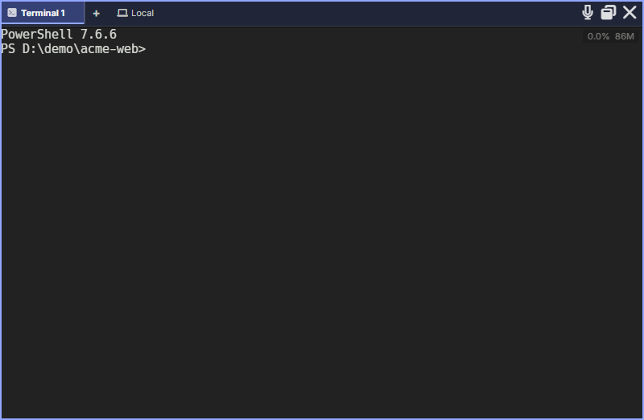

## Editor

A code editor with syntax highlighting, document tabs and language-server diagnostics.

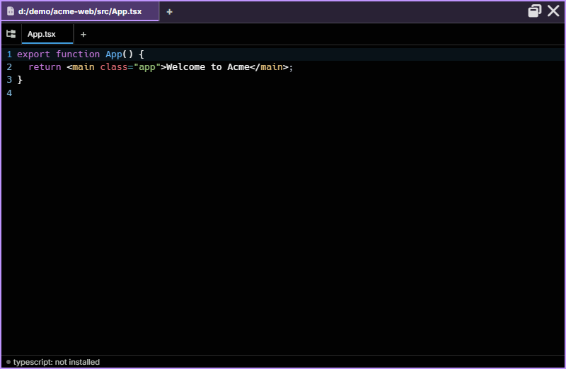

## Memory

Global and Personal Memory, Skills and Bundles. A new install has only AgentMux's own system entries. See [Memory](/memory/).

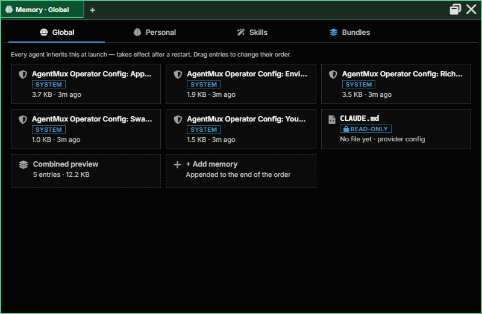

## Connectors

Accounts (sign-ins to providers and services) and MCP servers. Pick a provider to add an account. See [Connectors](/connectors/).

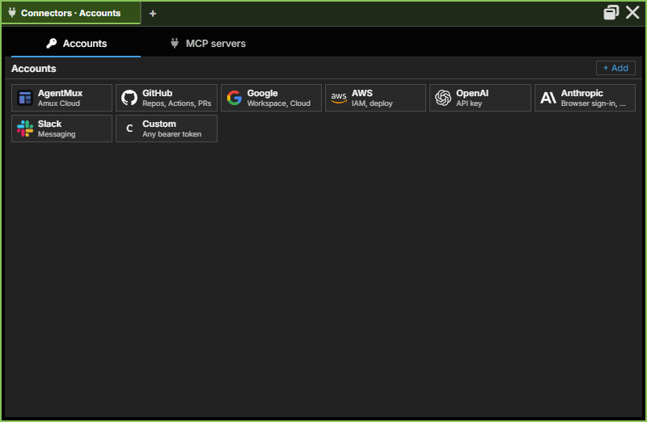

## Remotes

The SSH hosts AgentMux knows: the hosts in `~/.ssh/config` and any you've connected to.

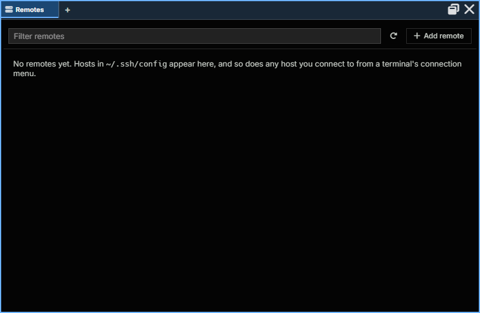

## Drone

A visual automation builder: drag Variables, Agent, API, Condition and Response blocks onto the canvas and wire them together.

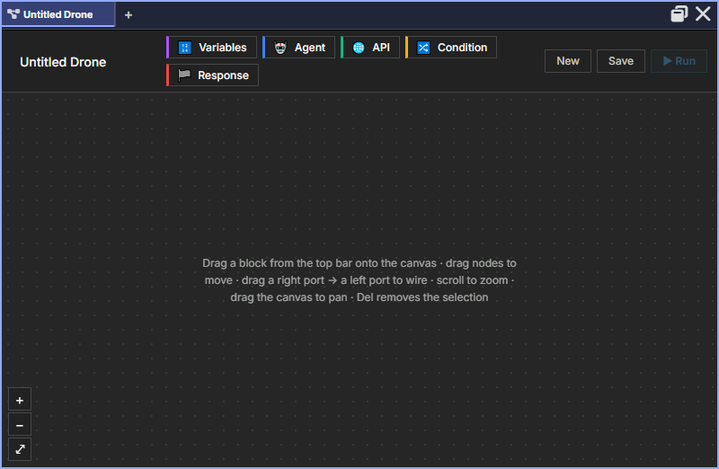

## Warden

Monitor and control agents on this host, on your LAN and over the internet, with an audit log. See [Warden](/warden/).

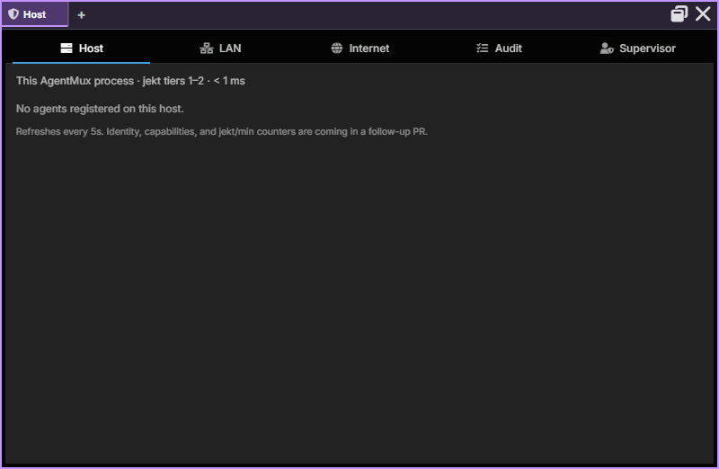

## Sysinfo

Live graphs of this computer's CPU, memory and network use; it can also show disk I/O and every CPU core. See [Sysinfo](/system-metrics/).

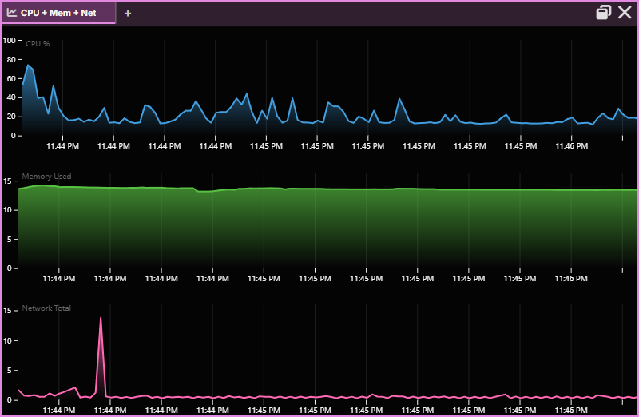

## Media

An image, video and audio viewer. Point it at a folder an agent writes into and it updates as new files arrive.

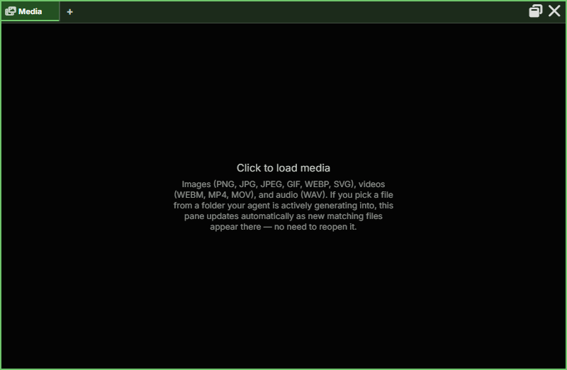

## Help

Built-in help: the header icons and every keyboard shortcut.

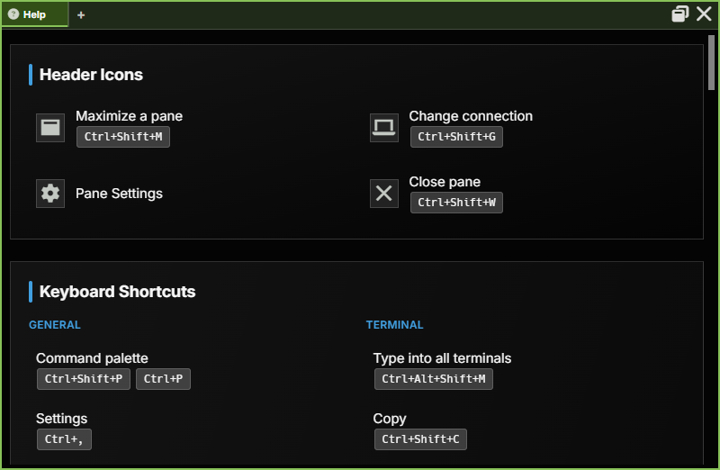

## Settings

Every setting, by section, with search. See [Settings](/settings/).

