:::caution[Alpha Software]
AgentMux is **alpha software** and under heavy active development. Many features described in these docs may be incomplete, unstable, or not yet implemented. Expect breaking changes between releases. We welcome bug reports and feedback on [GitHub Issues](https://github.com/agentmuxai/agentmux/issues) or [Discord](https://discord.com/invite/96erama9Ar).
:::

An AgentMux window has three parts: the **top bar**, the **panes** of the current tab, and the **status bar** along the bottom.

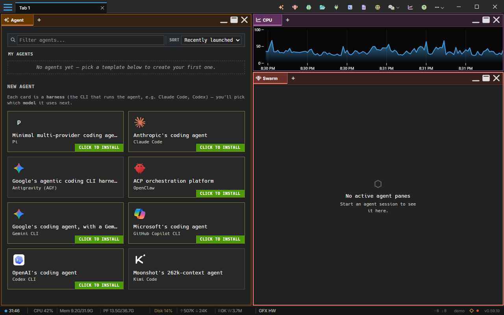

## Top bar

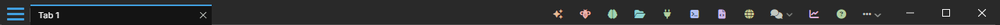

From left to right:

- **Hamburger menu (≡):** global actions and preferences. See [Main menu & command palette](/main-menu/).
- **Window tabs:** each tab holds its own layout of panes. **New Tab** (`Ctrl+Shift+T` / `⌘T`) adds one; drag a tab below the tab bar to [tear it off](/pane-types/#tab-tear-off) into a new window.
- **Widget bar:** one icon per pinned widget; click one to open it. Widgets that aren't pinned are under **more** at the end of the bar. Right-click a pinned icon to unpin it.
- **Window buttons:** minimize, maximize and close.

### The widget bar's More list

Hover **more** (or click it) to list the widgets that aren't pinned to the bar. Click one to open it.

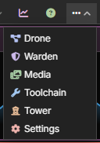

### A tab's menu

Right-click a window tab to colour it or rename it: pick one of 14 colours, **Clear color** to remove it, or **Rename**. The colour is stored with the tab (`tab:color`).

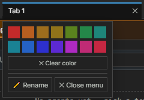

### Closing a tab

A tab's close button (×) asks first, because the tab's panes close with it. Tick **Don't ask again** (or turn on **Skip tab close confirmation** in [Settings → Window & Panes](/settings/#window--panes)) to close tabs straight away from then on.

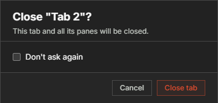

## Panes

Each pane has a header that is also its tab strip: a pane can hold several tabs of any widget type. The buttons at the right of the header minimize the pane, maximize it to fill the tab, and close it. Right-click the header for the pane's menu. See [Pane Management](/pane-types/#pane-management) for splitting, pane tabs, moving panes and floating them.

## Status bar

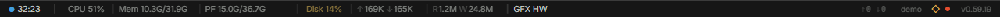

From left to right:

| Item | Shows | Click it for |
|------|-------|--------------|
| Backend status | A status dot and how long the backend has been up | The backend panel |
| **CPU** | Total CPU use | The load on each core |
| **GPU** | GPU use, where the platform reports it | — |
| **Mem** | Memory used and total | — |
| **PF** | Commit charge used and total: RAM plus the page file budget (Windows) | — |
| **Disk** | How much of the system drive is free (its colour warns as it fills) | Free space on each drive |
| ↑ ↓ | Network upload and download | — |
| **R** **W** | Disk reads and writes | — |
| **GFX** | Whether the window is drawn by the GPU (`HW`), in software (`SW`), or without WebGL | — |
| ↑ ↓ (right) | Tokens your agents have sent and received this session | Token usage by service |
| Host name | This computer's name, with the LAN discovery indicator (◇) and the MuxBus Cloud dot | The host panel |
| Version | The AgentMux version | The instance panel |

Hover an item for a short description. Each panel closes with `Esc` or a click outside it.

### Backend

The backend's status, process id, uptime and endpoint, and how the window is drawn: whether graphics are hardware accelerated, the WebGL version, and the graphics driver.

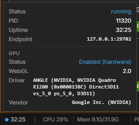

### CPU cores

The load on each CPU core, and the average.

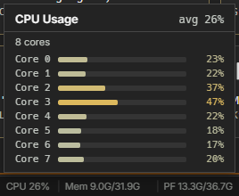

### Disk space

Each drive's free space and size. The **Disk** figure in the bar is the system drive's free share.

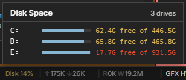

### Token usage

Tokens sent and received since the time shown, by service. **Reset counter** starts the count again.

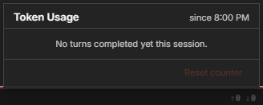

### Host

This computer: its OS, address, the backend's process id, and the version's data folder (click the path to open it in your file manager). Below that: the [LAN discovery](/lan-discovery/) switch and **Pair a device**, [MuxBus Cloud](/auth/) sign-in, and the local endpoints (IPC, backend, WebSocket, DevTools).

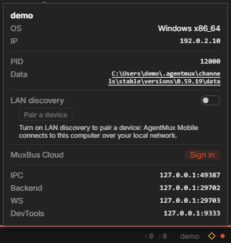

### Instance panel

This AgentMux instance: its version, channel, commit, CEF version, runtime and build time (each with a copy button), the windows this process has open with an opacity slider for each, its floating panes, and maintenance (database migrations and vacuum). **Open another window** opens a new window of this instance. See [Window appearance](/window-appearance/) for the opacity slider and [Report issues](/report-issues/) for what to copy into a bug report.

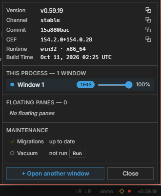

## See also

- [Main menu & command palette](/main-menu/)
- [Pane Types](/pane-types/) and [Pane Management](/pane-types/#pane-management)
- [Settings reference](/settings/)
- [System Metrics](/system-metrics/): the Sysinfo widget's graphs
